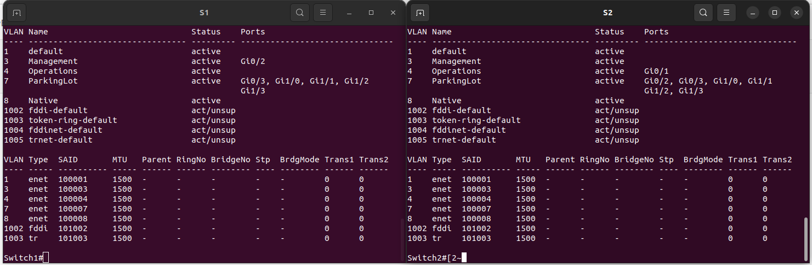

## Part:1 Build the Network and Configure Basic Device Settings

####c. Assign a device name to the router.<
R1(config)#hostname R1 

####d. Disable DNS lookup to prevent the router from attempting to translate incorrectly entered commands as though they were host names.
R1(config)#no ip domain-lookup 

####e. Assign class as the privileged EXEC encrypted password.
R1(config)#enable secret class 

####f. Assign cisco as the console password and enable login.
R1(config)#line console ? 
  <0-0>  First Line number 
R1(config)#line console 0 
R1(config-line)#password cisco 
R1(config-line)#login 
  
####g. Assign cisco as the VTY password and enable login.
R1(config)#line vty 0 4 
R1(config-line)#password cisco 
R1(config-line)#login 

####h. Encrypt the plaintext passwords.
R1#show run | beg line 
line con 0 
 password cisco 
 login 
line aux 0 
line vty 0 4 
 password cisco 
 login 
 transport input none 
! 
no scheduler allocate 
! 
end 

R1(config)#service password-encryption 
R1(config)#do show run | beg line 
line con 0 
 password 7 14141B180F0B 
 login 
line aux 0 
line vty 0 4 
 password 7 094F471A1A0A 
 login 
 transport input none 
! 
no scheduler allocate 
! 
end 

####i. Create a banner that warns anyone accessing the device that unauthorized access is prohibited.
R1(config)#banner login $  
\*\*\*\*\*\*\*\*\*\*\*\*\*\*\*\*\*\*\*\*\*\*\*\*\*\*\*\*\*\*\*\*\*\*\*\*\*\*\*\*\*\*\*\*\*\*\*\*\*\*\*\*\*\*\*\*\*\*\*\*\*\*\*\*\*\*\*\*\*\*
\*      Attention! Unauthorized access to this device is prohibited.      \*
\*\*\*\*\*\*\*\*\*\*\*\*\*\*\*\*\*\*\*\*\*\*\*\*\*\*\*\*\*\*\*\*\*\*\*\*\*\*\*\*\*\*\*\*\*\*\*\*\*\*\*\*\*\*\*\*\*\*\*\*\*\*\*\*\*\*\*\*\*\*$

####j. Save the running configuration to the startup configuration file.
R1#wr 

####k. Set the clock on the router.
R1(config)#clock timezone Moscow +3 0 
*Apr  8 20:20:30.623: %SYS-6-CLOCKUPDATE: System clock has been updated from 23:40:30 Moscow Sat Apr 8 2023 to 23:20:30 Moscow Sat Apr 8 2023, configured from console by console. 

Completed the same commands for S1 and S2 

##Part:2 Create VLANs and Assign Switch Ports

###Addressing Table
|Device|Interface|IP Address|Subnet Mask|Default Gateway|
|:----:|:-------:|:--------:|:---------:|:-------------:|
|R1|G0/0.3|192.168.3.1|255.255.255.0|N/A|
||G0/0.4|192.168.4.1|255.255.255.0|N/A|
||G0/0.8|N/A|N/A|N/A|
|S1|VLAN 3|192.168.3.11|255.255.255.0|192.168.3.1|
|S2|VLAN 3|192.168.3.12|255.255.255.0|192.168.3.1|
|PC-A|NIC|192.168.3.3|255.255.255.0|192.168.3.1|
|PC-B|NIC|192.168.4.3|255.255.255.0|192.168.4.1|

###VLAN Table
|VLAN|Name|Interface Assigned|
|:-|:-|:-|
|3|Management|S1: VLAN 3  S2: VLAN 3 S1: Gi0/2|
|4|Operations|S2: Gi0/1|
|7|ParkingLot|S1: Gi0/3, Gi1/0, Gi1/1, Gi1/2, Gi1/3  S2: Gi0/2, Gi0/3, Gi1/0, Gi1/1, Gi1/2, Gi1/3|
|:8|Native|N/A|

####: Assign VLANs to the correct switch interfaces.
>show vlan

