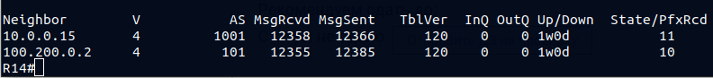
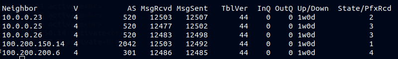
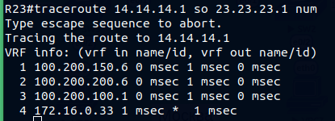
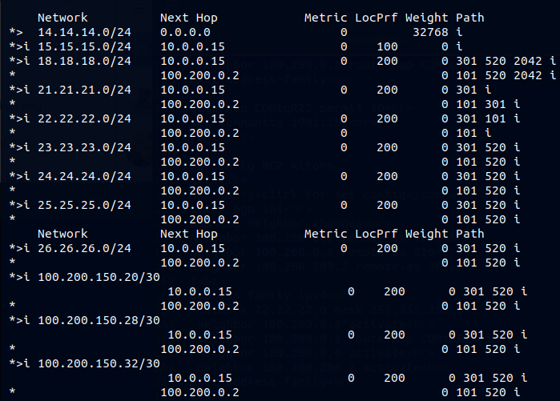
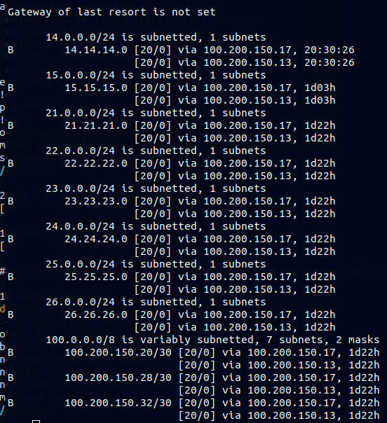

>Scheme 
 

### 1.Настроите iBGP в офисe Москва между маршрутизаторами R14 и R15. 

#### Москва BGP AS 1001 

|Device|Interface|IP address/net|network|neighbor ip/AS|
|:-|:-|:-|:-|:-|
|R14|lo0|10.0.0.14/32|14.14.14.0/24|10.0.0.15 1001|
|R14|lo1|14.14.14.1/24|14.14.14.0/24||
|R15|lo0|10.0.0.15/32|15.15.15.0/24|10.0.0.14 1001|
|R15|lo1|15.15.15.1/24|15.15.15.0/24||

 Соседство для iBGP устанавливаем с lo0 маршрутизаторов R14 и R15. Маршруты для сетей интерфейса lo0 
внутри нашей AS 1001 анонсируются по протоколу OSPF.  

R14 config BGP Moscow

  
click for see config

router bgp 1001 
 bgp log-neighbor-changes 
 neighbor 10.0.0.15 remote-as 1001 
 neighbor 10.0.0.15 update-source Loopback0 
 neighbor 100.200.0.2 remote-as 101 
 ! 
 address-family ipv4 
  network 14.14.14.0 mask 255.255.255.0 
  neighbor 10.0.0.15 activate 
  neighbor 10.0.0.15 next-hop-self 
  neighbor 100.200.0.2 activate 
 exit-address-family 

R15 config BGP Moscow

  
click for see config

router bgp 1001 
 bgp log-neighbor-changes 
 neighbor 10.0.0.14 remote-as 1001 
 neighbor 10.0.0.14 update-source Loopback0 
 neighbor 100.200.100.2 remote-as 301 
 ! 
 address-family ipv4 
  network 15.15.15.0 mask 255.255.255.0 
  neighbor 10.0.0.14 activate 
  neighbor 10.0.0.14 next-hop-self 
  neighbor 100.200.100.2 activate 
 exit-address-family 

>R14#show ip bgp summ 
 

### 2.Настроите iBGP в провайдере Триада, с использованием RR. 

#### Триада AS 520 

|Device|Interface|IP address/net|network|neighbor ip/AS|
|:-|:-|:-|:-|:-|
|R23|lo0|10.0.0.23/32|23.23.23.0/24|10.0.0.24 520|
||lo1||23.23.23.1/24||
|R24|lo0|10.0.0.24/32|24.24.24.0/24|10.0.0.23 520|
||lo1|24.24.24.1/24||10.0.0.25 520|
|||||10.0.0.26 520|
|R25|lo0|10.0.0.25/32|25.25.25.0/24|10.0.0.24 520|
||lo1|25.25.25.1/24|100.200.150.28/30||
||||100.200.150.24/30||
|R26|lo0|10.0.0.26/32|26.26.26.0/24|10.0.0.24 520|
||lo1|26.26.26.1/24|100.200.150.20/30||

Соседство для iBGP устанавливаем с lo0 маршрутизаторов R23,R24,R25,R26. Маршруты для сетей интерфейса lo0 
внутри нашей AS 520 анонсируются по протоколу IS-IS, R24 назначена роль RouteReflector.

R24 config BGP Triada

  
click for see config

router bgp 520 
 bgp log-neighbor-changes 
 neighbor AS520 peer-group 
 neighbor AS520 remote-as 520 
 neighbor AS520 update-source Loopback0 
 neighbor 10.0.0.23 peer-group AS520 
 neighbor 10.0.0.25 peer-group AS520 
 neighbor 10.0.0.26 peer-group AS520 
 neighbor 100.200.150.14 remote-as 2042 
 neighbor 100.200.200.6 remote-as 301 
 ! 
 address-family ipv4 
  network 24.24.24.0 mask 255.255.255.0 
  neighbor AS520 route-reflector-client 
  neighbor AS520 next-hop-self 
  neighbor 10.0.0.23 activate 
  neighbor 10.0.0.25 activate 
  neighbor 10.0.0.26 activate 
  neighbor 100.200.150.14 activate 
  neighbor 100.200.200.6 activate 
 exit-address-family 

R24#show ip bgp sum 
 

### 3.Настройте офиса Москва так, чтобы приоритетным провайдером стал Ламас. 

На R15 назначили через route-map LocalPref 200 с провайдером Ламас для исходящего трафика. 
На входящий трафик повлияли путём увеличения as-path для провайдера Китрон - настроили community. 

R15 config BGP Moscow

  
click for see config

router bgp 1001 
 bgp log-neighbor-changes 
 neighbor 10.0.0.14 remote-as 1001 
 neighbor 10.0.0.14 update-source Loopback0 
 neighbor 100.200.100.2 remote-as 301 
 ! 
 address-family ipv4 
  network 15.15.15.0 mask 255.255.255.0 
  neighbor 10.0.0.14 activate 
  neighbor 10.0.0.14 next-hop-self 
  neighbor 100.200.100.2 activate 
  neighbor 100.200.100.2 route-map MAIN in 
 exit-address-family 
 ! 
route-map MAIN permit 10 
 set local-preference 200 

R14 config BGP Moscow

  
click for see config

router bgp 1001 
 bgp log-neighbor-changes 
 neighbor 10.0.0.15 remote-as 1001 
 neighbor 10.0.0.15 update-source Loopback0 
 neighbor 100.200.0.2 remote-as 101 
 ! 
 address-family ipv4 
  network 14.14.14.0 mask 255.255.255.0 
  neighbor 10.0.0.15 activate 
  neighbor 10.0.0.15 next-hop-self 
  neighbor 100.200.0.2 activate 
  neighbor 100.200.0.2 send-community both 
  neighbor 100.200.0.2 route-map COMtoR22 out 
 exit-address-family 
 ! 
route-map COMtoR22 permit 10 
 set community 1001:103 

 
R22 config BGP Kitorn

  
click for see config

router bgp 101 
 bgp log-neighbor-changes 
 neighbor 100.200.0.1 remote-as 1001 
 neighbor 100.200.0.6 remote-as 520 
 neighbor 100.200.200.2 remote-as 301 
 ! 
 address-family ipv4 
  network 22.22.22.0 mask 255.255.255.0 
  neighbor 100.200.0.1 activate 
  neighbor 100.200.0.1 route-map COMtoR14 in 
  neighbor 100.200.0.6 activate 
  neighbor 100.200.200.2 activate 
 exit-address-family 
 ! 
ip community-list 1 permit 1001:103 
 ! 
route-map COMtoR14 permit 10 
 match community 1 
 set as-path prepend last-as 3 

R23#traceroute 14.14.14.1 so 23.23.23.1 
 

R14#show ip bgp 
 

### 4.Настройте офиса С.-Петербург так, чтобы трафик до любого офиса распределялся по двум линкам одновременно. 

R18 config BGP SPB

  
click for see config

router bgp 2042 
 bgp log-neighbor-changes 
 network 18.18.18.0 mask 255.255.255.0 
 neighbor 100.200.150.13 remote-as 520 
 neighbor 100.200.150.17 remote-as 520 
 maximum-paths 2 

R18#show ip route bgp 
 

