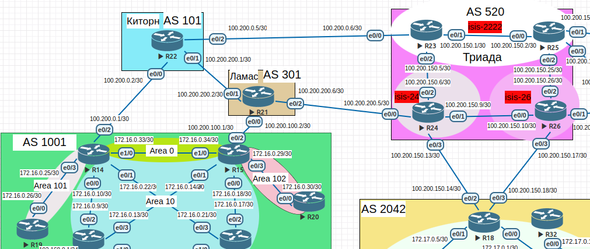
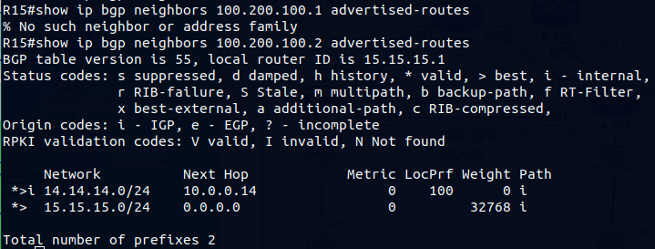

>Scheme<br>
<br>

### 1.Настроить фильтрацию в офисе Москва так, чтобы не появилось транзитного трафика(As-path).<br>

#### Москва BGP AS 1001<br>

|Device|Interface|IP address/net|network|neighbor ip/AS|
|:-|:-|:-|:-|:-|
|R14|lo0|10.0.0.14/32|14.14.14.0/24|10.0.0.15 1001|
|R14|lo1|14.14.14.1/24|14.14.14.0/24||
|R15|lo0|10.0.0.15/32|15.15.15.0/24|10.0.0.14 1001|
|R15|lo1|15.15.15.1/24|15.15.15.0/24||

 На маршрутизаторах R14 и R15 создали ip as-path-access-list(ы). В первом листе  используя regexp пропускаем сети с пустым значением as-path,<br>
во втором лисет - запрещаем все непустые значения в as-path. Далее добавили наши листы в route-map.<br>

R14<br>
```
ip as-path access-list 10 permit ^$
ip as-path access-list 20 deny .*
!
route-map COMtoR22 permit 10
 match as-path 10
 set community 1001:103
!
route-map COMtoR22 permit 20
 match as-path 20
```
<br>

R15<br>
```
ip as-path access-list 10 permit ^$
ip as-path access-list 20 deny .*
!
route-map FilterOut permit 10
 match as-path 10
!
route-map FilterOut permit 20
 match as-path 20
```
<br>

<br>


### 2.Настроить фильтрацию в офисе С.-Петербург так, чтобы не появилось транзитного трафика(Prefix-list).<br>


