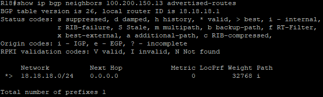
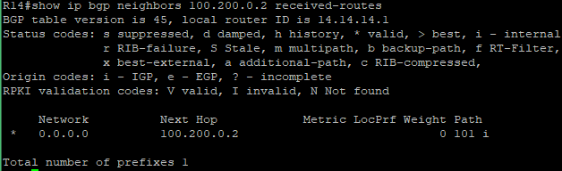
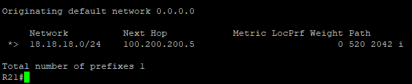

>Scheme<br>
<br>

### 1.Настроить фильтрацию в офисе Москва так, чтобы не появилось транзитного трафика(As-path).<br>

#### Москва BGP AS 1001<br>

|Device|Interface|IP address/net|network|neighbor ip/AS|
|:-|:-|:-|:-|:-|
|R14|lo0|10.0.0.14/32|14.14.14.0/24|10.0.0.15 1001|
|R14|lo1|14.14.14.1/24|14.14.14.0/24||
|R15|lo0|10.0.0.15/32|15.15.15.0/24|10.0.0.14 1001|
|R15|lo1|15.15.15.1/24|15.15.15.0/24||

 На маршрутизаторах R14 и R15 создали ip as-path-access-list(ы). В первом листе  используя regexp пропускаем сети с пустым значением as-path,<br>
во втором листе \- запрещаем все непустые значения в as-path. Далее добавили наши листы в route-map.<br>

R14<br>
```
ip as-path access-list 10 permit ^$
ip as-path access-list 20 deny .*
!
route-map COMtoR22 permit 10
 match as-path 10
 set community 1001:103
!
route-map COMtoR22 permit 20
 match as-path 20
```
<br>

R15<br>
```
ip as-path access-list 10 permit ^$
ip as-path access-list 20 deny .*
!
route-map FilterOut permit 10
 match as-path 10
!
route-map FilterOut permit 20
 match as-path 20
```
<br>

<br>


### 2.Настроить фильтрацию в офисе С.-Петербург так, чтобы не появилось транзитного трафика(Prefix-list).<br>

 Создаём prefix-list с сетями которые будем анонсировать по bgp нашим соседям. Добавляем наш prefix-list в route-map, route-map на out<br>
прописываем нашим соседям bgp.<br>

```
ip prefix-list 1 seq 5 permit 18.18.18.0/24
!
route-map R18-out permit 10
 match ip address prefix-list 1
!
 neighbor 100.200.150.13 route-map R18-out out
 neighbor 100.200.150.17 route-map R18-out out
```
<br>

<br>


### 3.Настроить провайдера Киторн так, чтобы в офис Москва отдавался только маршрут по умолчанию.<br>

 На маршрутизаторе Киторн R22 создаём prefix-list в котором запрещаем все префиксы, через route-map фильтруем все анонсируемые маршруты<br> 
в сторону R14, плюс оригинируем анонс маршрута по умолчанию.<br>

R22 config BGP Kitorn
<details>
  <summary>click for see config</summary>
router bgp 101<br>
 bgp log-neighbor-changes<br>
 neighbor 100.200.0.1 remote-as 1001<br>
 neighbor 100.200.0.6 remote-as 520<br>
 neighbor 100.200.200.2 remote-as 301<br>
 !<br>
 address-family ipv4<br>
  network 22.22.22.0 mask 255.255.255.0<br>
  neighbor 100.200.0.1 activate<br>
  neighbor 100.200.0.1 default-originate<br>
  neighbor 100.200.0.1 route-map COMtoR14 in<br>
  neighbor 100.200.0.1 route-map default-out out<br>
  neighbor 100.200.0.6 activate<br>
  neighbor 100.200.200.2 activate<br>
!<br>
ip prefix-list default seq 5 deny 0.0.0.0/0 le 32<br>
!<br>
route-map default-out permit 10<br>
 match ip address prefix-list default<br>
</details>

R14#show ip bgp neighbors 100.200.0.2 received-routes<br>
<br>


### 4.Настроить провайдера Ламас так, чтобы в офис Москва отдавался только маршрут по умолчанию и префикс офиса С.-Петербург.<br>

 На маршрутизаторе Ламас R21 создаём prefix-list в котором разрешаем префикс СПБ, запрещаем все остальные префиксы,<br> 
через route-map фильтруем все анонсируемые маршруты в сторону R15, плюс оригинируем анонс маршрута по умолчанию.<br>

R21 config BGP Lamas
<details>
  <summary>click for see config</summary>
router bgp 301<br>
 bgp log-neighbor-changes<br>
 neighbor 100.200.100.1 remote-as 1001<br>
 neighbor 100.200.200.1 remote-as 101<br>
 neighbor 100.200.200.5 remote-as 520<br>
 !<br>
 address-family ipv4<br>
  network 21.21.21.0 mask 255.255.255.0<br>
  neighbor 100.200.100.1 activate<br>
  neighbor 100.200.100.1 default-originate<br>
  neighbor 100.200.100.1 route-map to-R15-out out<br>
  neighbor 100.200.200.1 activate<br>
  neighbor 100.200.200.5 activate<br>
!<br>
ip prefix-list to-AS-2042 seq 5 permit 18.18.18.0/24<br>
ip prefix-list to-AS-2042 seq 10 deny 0.0.0.0/0 le 32<br>
!<br>
route-map to-R15-out permit 10<br>
 match ip address prefix-list to-AS-2042<br>
</details>

R21#show ip bgp neighbors 100.200.100.1 advertised-routes<br>
<br>
