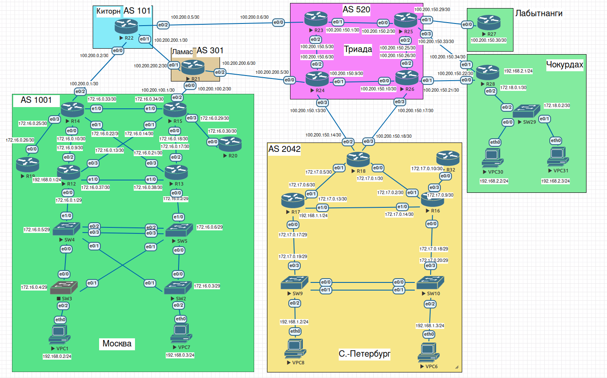
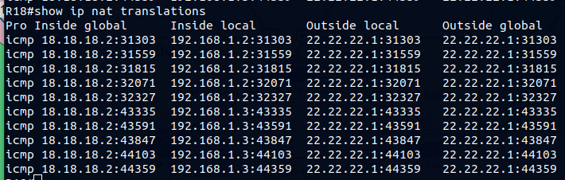
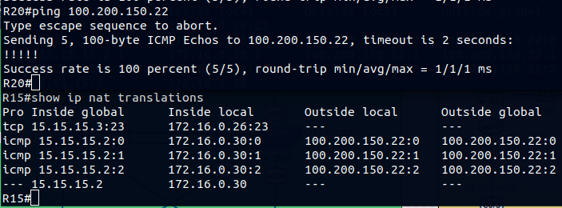
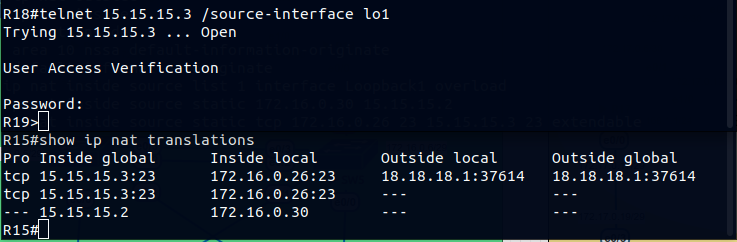
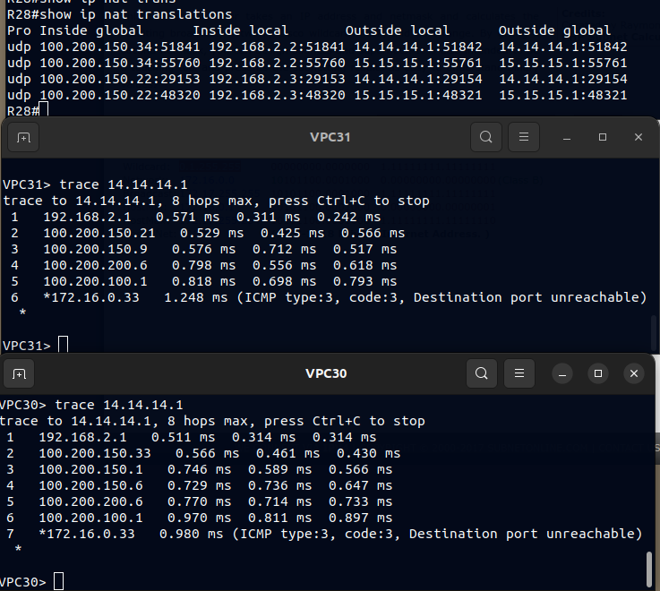
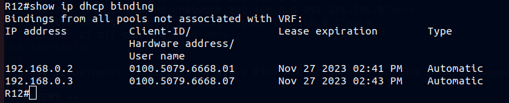
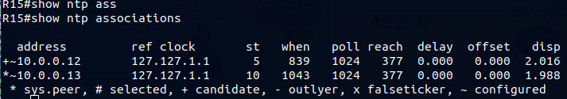

>SCHEME<br>
<br>

### 1.Настроить NAT(PAT) на R14 и R15. Трансляция должна осуществляться в адрес автономной системы AS1001.<br>

 На маршрутизаторах R14 и R15 создали ip access-list в которм указали сеть для натирования. Интерфейсы<br>
в сторону Интернет(eth0/2) и находящиеся внутри сети(eth1/0, eth0/0-1, eth0/3) пометили соотвественно их<br>
назначению для для работы протокола NAT. Добаыили правило трансляции адресов с указанием на интерфейс<br>
ip которого будем использоать для выхода в сеть интернет.<br>

```
R14#
Standard IP access list 1
    10 permit 192.168.0.0, wildcard bits 0.0.0.255
!
nterface Ethernet0/2
 ip nat outside
!
interface Ethernet0/0
 ip nat inside
!
ip nat inside source list 1 interface Loopback1 overload
```
<br>

### 2.Настроите NAT(PAT) на R18. Трансляция должна осуществляться в пул из 5 адресов автономной системы AS2042.<br>

 Аналогично первому пункту, только добавили nat pool из 5 интернет адресов и указали его в правиле nat.<br>

```
ip nat pool to-internet 18.18.18.2 18.18.18.6 netmask 255.255.255.0
ip nat inside source list 1 pool to-internet overload
```
<br>

<br>

### 3.Настроите статический NAT для R20.<br>

 На R15 добавил статическое правило NAT для ip eth0/0 R20.<br>
```
ip nat inside source static 172.16.0.30 15.15.15.2
```
<br>

<br>

### 4.Настроите NAT так, чтобы R19 был доступен с любого узла для удаленного управления.<br>
 
 На R15 добавил статическую запись трансляции порта управления(telnet) для nat с указанием ip R19 и отдельного ip AS1001<br>
```
ip nat inside source static tcp 172.16.0.26 23 15.15.15.3 23 extendable
```
<br>

<br>

### 5\*. Настроите статический NAT(PAT) для офиса Чокурдах.<br>
 
 В офисе Чокурдах настроено два интерфеса в сторону Интернет с ip sla и балансировкой нагрузки. Статический PAT не подходит<br>
в моём случае. Для работы nat и сохранения логики работы ip sla с балансировкой нагрузки - добавил route-map для nat,<br>
добавил два правила работы nat для каждого интерфеса маршрутизатора с указанием route-map.
```
route-map map-fa0/1, permit, sequence 10
  Match clauses:
    ip address (access-lists): 1 
    interface Ethernet0/1 
  Set clauses:
  Policy routing matches: 0 packets, 0 bytes
route-map map-fa0/0, permit, sequence 10
  Match clauses:
    ip address (access-lists): 1 
    interface Ethernet0/0 
  Set clauses:
  Policy routing matches: 0 packets, 0 bytes
!
ip nat inside source route-map map-fa0/0 interface Ethernet0/0 overload
ip nat inside source route-map map-fa0/1 interface Ethernet0/1 overload
```
<br>

<br>

### 5.Настроите для IPv4 DHCP сервер в офисе Москва на маршрутизаторах R12 и R13. VPC1 и VPC7 должны получать сетевые<br> 
### настройки по DHCP.<br>

 На R12 исключаем ip адреса принадлежвщие роутерам, и создаём пулл адресов для клиентов dhcp. Интерфесы R12 и R13 eth0/0.200<br>
объединены в одну HSRP группу. При возникновении проблем на R12 роутер R13 становится основным и запускает свой dhcp-server.<br>
Через логическую конструкцию track на R13 меняем стоимость ospf интерфеса сети dhcp так, чтобы для других участников ospf<br>
наш роутер становился основным для сети dhcp.<br>

R12 config dhcp
<details>
  <summary>click for see config</summary>
!<br>
ip dhcp excluded-address 192.168.0.1<br>
ip dhcp excluded-address 192.168.0.253 192.168.0.254<br>
!<br>
ip dhcp pool Clients<br>
 network 192.168.0.0 255.255.255.0<br>
 default-router 192.168.0.1 <br>
!<br>
interface Ethernet0/0.200<br>
 description for_Clients_dhcp<br>
 encapsulation dot1Q 200<br>
 ip address 192.168.0.253 255.255.255.0<br>
 standby version 2<br>
 standby 1 ip 192.168.0.1<br>
 standby 1 priority 150<br>
 standby 1 preempt<br>
 ip ospf 1 area 10<br>
!<br>
</details>

R13 config dhcp
<details><br>
  <summary>click for see config</summary><br>
!<br>
track 10 ip sla 1 reachability<br>
 delay down 10 up 10<br>
!<br>
track 50 list boolean and<br>
 object 10 not<br>
 object 100<br>
!<br>
track 100 interface Ethernet0/0 line-protocol<br>
 delay down 5 up 5<br>
!<br>
interface Ethernet0/0.200<br>
 encapsulation dot1Q 200<br>
 ip address 192.168.0.254 255.255.255.0<br>
 standby version 2<br>
 standby 1 ip 192.168.0.1<br>
 standby 1 track 100 shutdown<br>
 ip ospf 1 area 10<br>
!<br>
!<br>
ip sla 1<br>
 icmp-echo 192.168.0.253 source-ip 192.168.0.254<br>
 threshold 2<br>
 timeout 4000<br>
 frequency 6<br>
ip sla schedule 1 life forever start-time now<br>
!<br>
event manager applet cost-ospf<br>
 event track 50 state down<br>
 action 1 cli command "enable"<br>
 action 2 cli command "conf t"<br>
 action 3 cli command "int eth0/0.200"<br>
 action 4 cli command "no ip ospf cost 5"<br>
 action 5 cli command "exit"<br>
 action 6 cli command "no ip dhcp excluded-address 192.168.0.253 192.168.0.254"<br>
 action 7 cli command "no ip dhcp excluded-address 192.168.0.1"<br>
 action 8 cli command "no ip dhcp pool Clients"<br>
event manager applet dhcp-up<br>
 event track 50 state up<br>
 action 11 cli command "enable"<br>
 action 12 cli command "conf t"<br>
 action 13 cli command "int eth0/0.200"<br>
 action 14 cli command "ip ospf cost 5"<br>
 action 15 cli command "exit"<br>
 action 16 cli command "ip dhcp excluded-address 192.168.0.253 192.168.0.254"<br>
 action 17 cli command "ip dhcp excluded-address 192.168.0.1"<br>
 action 18 cli command "ip dhcp pool Clients"<br>
 action 19 cli command "network 192.168.0.0 255.255.255.0"<br>
 action 20 cli command "default-router 192.168.0.1"<br>
 action 21 cli command "end"<br>
</details>

<br>

### 6.Настроите NTP сервер на R12 и R13. Все устройства в офисе Москва должны синхронизировать время с R12 и R13.<br>
 
 На R12 установили<br>
```ntp master 5``` 

на R13<br>
```ntp master 10 
ntp server 10.0.0.12
```
<br>

На всех остальных роутерах в Москве прописали два ntp<br>
```
ntp server 10.0.0.12
ntp server 10.0.0.13
```
<br>

<br>
