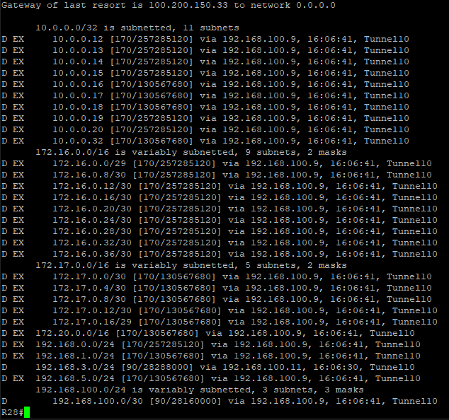

### 1. Настроите GRE между офисами Москва и С.-Петербург.<br>

 Создаём tun интерфейсы на R15 и R18. На R18 инициируем eigrp с редистрибьюцией маршрутов из уже существующего eigrp,<br> 
на R15 инициируем eigrp процесс с редистрибьюцией маршрутов из ospf. Запускаем eigrp на сети для туннельного интерфейса.<br>

R15 gre
```
!
interface Tunnel1
 ip address 192.168.100.1 255.255.255.252
 ip mtu 1400
 ip tcp adjust-mss 1360
 keepalive 10 5
 tunnel source 15.15.15.1
 tunnel destination 18.18.18.1
!
router eigrp 1
 network 192.168.100.0 0.0.0.3
redistribute ospf 1 metric 10 20 100 200 1400
```
<br>

R18 gre
```
router eigrp 1
 network 192.168.100.0 0.0.0.3
 redistribute eigrp 2042 metric 20 30 100 200 1400
!
interface Tunnel1
 ip address 192.168.100.2 255.255.255.252
 ip mtu 1400
 ip tcp adjust-mss 1360
 keepalive 10 5
 tunnel source 18.18.18.1
 tunnel destination 15.15.15.1
```
<br>

### 2.Настроите DMVMN между Москва и Чокурдах, Лабытнанги.<br>

 На маршрутизаторе R15 создаём отдельный tun интерфейс, определяем его как hub-сервер(nhs) а маршрутизаторы R27 и R28<br>
клиенты(spoke). Добавляем сеть туннеля в протокол маршрутизации EIGRP, на tun10 R15 добавляем настройки для поддержки<br>
работы протокола EIGRP с несколькими клиентами одновременно.<br>

R15 hub DMVPN<br>
```
interface Tunnel10
 ip address 192.168.100.9 255.255.255.248
 no ip redirects
 ip mtu 1400
 no ip next-hop-self eigrp 1
 no ip split-horizon eigrp 1
 ip nhrp map multicast dynamic
 ip nhrp network-id 10
 ip tcp adjust-mss 1360
 tunnel source 15.15.15.1
 tunnel mode gre multipoint
!
router eigrp 1
network 192.168.100.8 0.0.0.7

```
<br>

R27 spoke DMVPN<br>
```
!
interface Tunnel10
 ip address 192.168.100.11 255.255.255.248
 ip mtu 1400
 ip nhrp map multicast 15.15.15.1
 ip nhrp map 15.15.15.1 192.168.100.9
 ip nhrp network-id 10
 ip nhrp nhs 192.168.100.9
 ip tcp adjust-mss 1360
 tunnel source 100.200.150.30
 tunnel destination 15.15.15.1
!
!
router eigrp 1
 network 192.168.3.0
 network 192.168.100.8 0.0.0.7
 eigrp router-id 27.27.27.1
```
<br>

R28 spoke DMVPN<br>
```
interface Tunnel10
 ip address 192.168.100.10 255.255.255.248
 ip mtu 1400
 ip nhrp map multicast 15.15.15.1
 ip nhrp map 15.15.15.1 192.168.100.9
 ip nhrp network-id 10
 ip nhrp nhs 192.168.100.9
 ip tcp adjust-mss 1360
 tunnel source 100.200.150.34
 tunnel destination 15.15.15.1
!
router eigrp 1
 network 172.18.0.0 0.0.0.3
 network 192.168.2.0
 network 192.168.100.8 0.0.0.7
 eigrp router-id 28.28.28.1
```
<br>

Проверяем:<br>

R28#show ip route EIGRP
<br>

<br>
