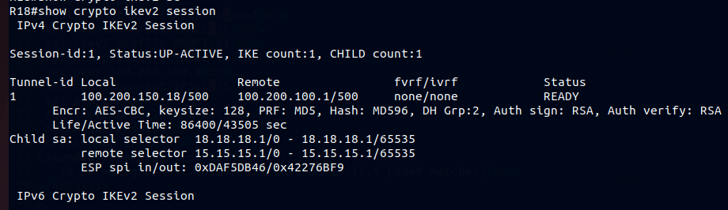
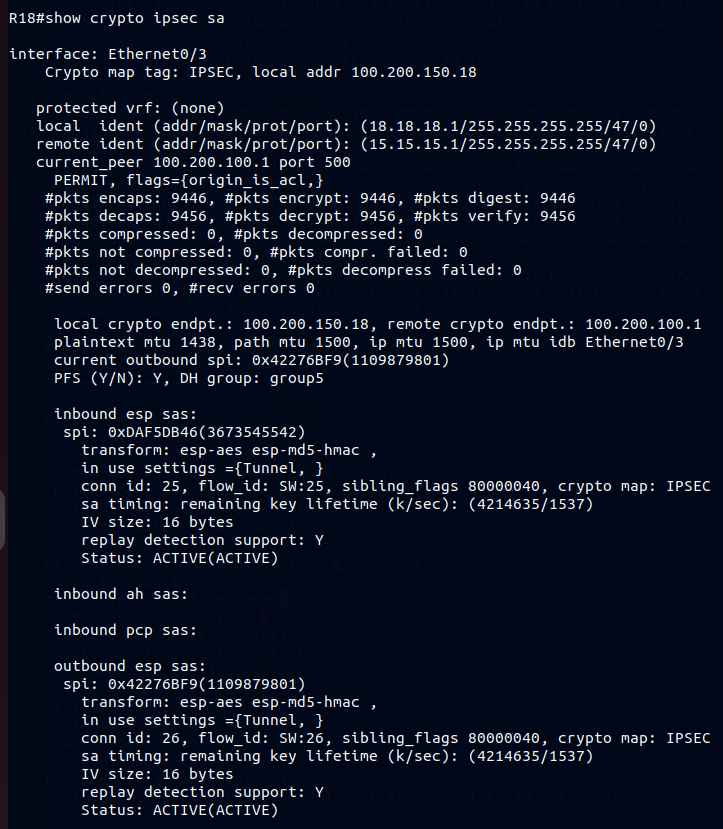
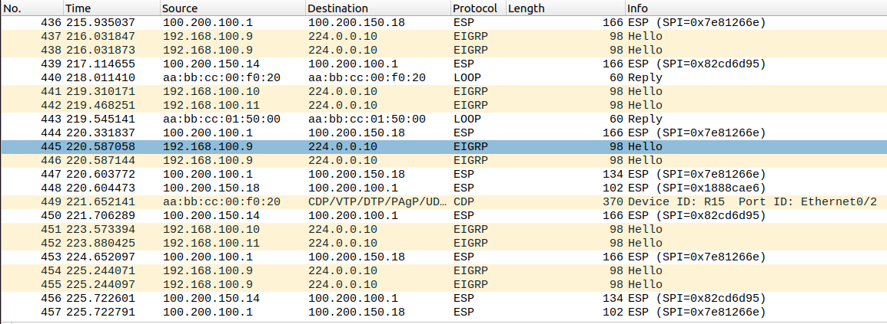
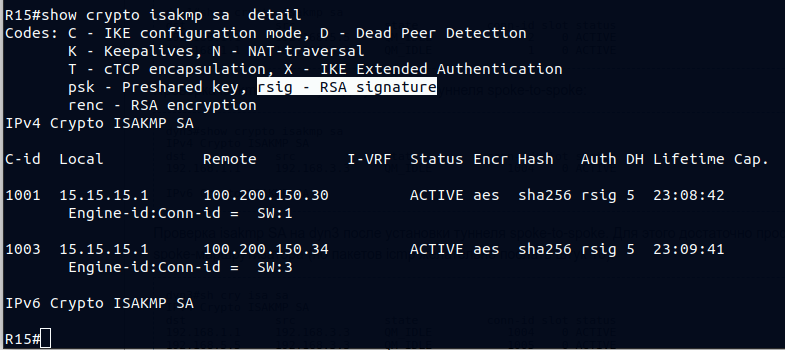
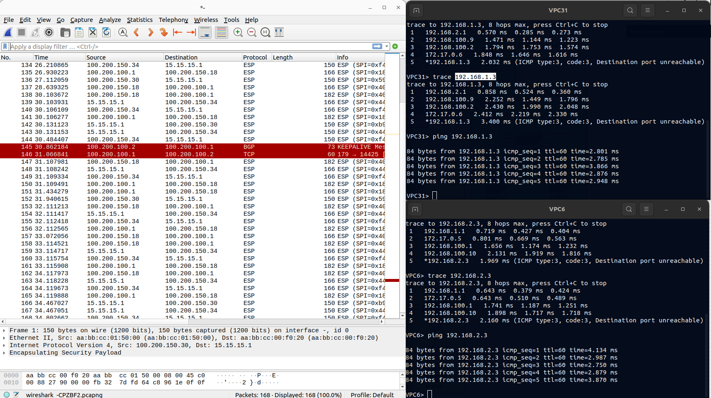

### 1.Настроите GRE поверх IPSec между офисами Москва и С.-Петербург. 

Между маршрутизаторами R15 и R18 поднимаем IPSeс туннель и трафик ранее настроенного GRE заворачиваем в защищённый туннель. 
Для аутентификации участников защищённого туннеля будем использовать сертификаты с центорм сертификации на R14. 
IPSec настраиваем между ip eth0/3 R18 и ip eth0/2 R15 

R18#show run | sec crypto

  
click for see config

crypto pki trustpoint VPN 
 enrollment url http://14.14.14.1:80 
 serial-number 
 subject-name CN=R2,OU=VPN,O=Moscow,C=RU 
 revocation-check none 
 rsakeypair VPN 
crypto pki certificate chain VPN 
 certificate 0A 
  30820273 3082021D A0030201 0202010A 300D0609 2A864886 F70D0101 05050030  
  0D310B30 09060355 04031302 4341301E 170D3233 31323033 31333131 35375A17  
  0D323431 32303231 33313135 375A305E 310B3009 06035504 06130252 55310F30  
  0D060355 040A1306 4D6F7363 6F77310C 300A0603 55040B13 0356504E 310B3009  
  06035504 03130252 32312330 0F060355 04051308 36373130 39313532 30100609  
  2A864886 F70D0109 02160352 31383082 0122300D 06092A86 4886F70D 01010105  
  00038201 0F003082 010A0282 010100BE 75495551 B535868F CD9B27C6 0CB9277D  
  527E8525 16E2FB9D F5059D52 5CC930C9 F16B8C9D 7B54FBE9 C6238564 52382B44  
  F606B9BF B0ECA74C B4BA54A5 BA3869FA 1C9DE57F 7CE29379 41379AB1 CE46B9C9  
  E536D37A A6E57EF3 107685EC B7ED1BD4 1EF76BD9 A8650DA5 D7F8746B 763BB0D2  
  BEA84A04 D45F6712 E4096E1B E4AE9360 CE984100 DD5CADEC 4B015ACE 3B84B795  
  4E3B9AC1 8D2ABC93 77D9E4C0 6C0EBADA 6E9107E5 BC2C8501 62875D14 3FF4C839  
  6D2E664E 14684D43 9A312047 D5FD429C 0C81A618 491ED083 DBC1C6E4 AC38C175  
  CFB661CC 566DD6C6 9CF3ACA5 651A6F29 DF4C1793 110E424E 60CF7DDE 653F223E  
  605EDA39 BF729BAE 8E9CF64B 5E641502 03010001 A34F304D 300B0603 551D0F04  
  04030205 A0301F06 03551D23 04183016 80142B2F 81B2806D 492B15B8 AF7782C1  
  9ADA87FA A3B6301D 0603551D 0E041604 149F1BAA 9C34B213 61916489 6B83E346  
  21635D66 26300D06 092A8648 86F70D01 01050500 03410023 2807C279 503ABD30  
  BD4AC64E 41AF6C45 A012B57B 0390E5D4 933B345D AEDCAF63 A142A5DE ED6246FA  
  6C276FF4 6CBD2362 EC18C2A5 7403FF50 FA48BC48 2685AD 
  	quit 
 certificate ca 01 
  3082016E 30820118 A0030201 02020101 300D0609 2A864886 F70D0101 04050030  
  0D310B30 09060355 04031302 4341301E 170D3233 31313238 31333530 31345A17  
  0D323631 31323731 33353031 345A300D 310B3009 06035504 03130243 41305C30  
  0D06092A 864886F7 0D010101 0500034B 00304802 4100B372 D44C1A5E AD5C8EA0  
  8A0C3167 53104D27 507C61A6 9C597E4E 6CAAE9F3 3C364712 E7D82F48 B11285AC  
  7351AF05 24F571D0 06354FDE D6483982 03586525 80D30203 010001A3 63306130  
  0F060355 1D130101 FF040530 030101FF 300E0603 551D0F01 01FF0404 03020186  
  301F0603 551D2304 18301680 142B2F81 B2806D49 2B15B8AF 7782C19A DA87FAA3  
  B6301D06 03551D0E 04160414 2B2F81B2 806D492B 15B8AF77 82C19ADA 87FAA3B6  
  300D0609 2A864886 F70D0101 04050003 4100A8EC EB645932 F2DA52CA 883A4729  
  75789D50 BECE2155 2125069A 51FBD9BF 69DF2641 10C4ECCA 5C71CF3C BA23FEAA  
  CD43A349 740CF0FB 3FF07674 91AA9ABD 645E 
  	quit 
crypto ikev2 proposal PHASE1  
 encryption aes-cbc-128 
 integrity md5 
 group 2   
crypto ikev2 policy IKEV2  
 proposal PHASE1 
crypto ikev2 profile PROFILE1 
 match address local interface Ethernet0/3 
 match identity remote address 0.0.0.0  
 authentication remote rsa-sig 
 authentication local rsa-sig 
 pki trustpoint VPN 
crypto ipsec transform-set IPSEC\_TS esp-aes esp-md5-hmac  
 mode transport 
crypto ipsec profile ipsec\_prof 
 set transform-set IPSEC\_TS  
 set ikev2-profile PROFILE1 
crypto map IPSEC 1 ipsec-isakmp  
 set peer 100.200.100.1 
 set transform-set IPSEC\_TS  
 set pfs group5 
 set ikev2-profile PROFILE1 
 match address 101 
 crypto map IPSEC 
Extended IP access list 101 
   10 permit gre host 18.18.18.1 host 15.15.15.1 (9349 matches) 

 

 

 

Сёъм трафика показывает только протокол ESP зашифрованного туннеля IPsec, пакеты работы протоколов EIGRP и GRE скрыты внутри туннеля. 

### 2.Настроите DMVPN поверх IPSec между Москва и Чокурдах, Лабытнанги. 

Между данными офисами у нас настроен DMVPN, для обмена ключами использовал протокол IKEv1 с аутентификацией по сертефикатам. 

R28#show run | sec crypto 

  
click for see config

crypto pki trustpoint VPN 
 enrollment url http://14.14.14.1:80 
 ip-address 100.200.150.34 
 subject-name CN=R2,OU=VPN,O=Moscow,C=RU 
 revocation-check none 
 rsakeypair VPN 
crypto pki certificate chain VPN 
 certificate 02 
  308201B7 30820161 A0030201 02020102 300D0609 2A864886 F70D0101 05050030  
  0D310B30 09060355 04031302 4341301E 170D3233 31313238 31333534 32335A17  
  0D323431 31323731 33353432 335A306A 310B3009 06035504 06130252 55310F30  
  0D060355 040A1306 4D6F7363 6F77310C 300A0603 55040B13 0356504E 310B3009  
  06035504 03130252 32312F30 1006092A 864886F7 0D010902 16035232 38301B06  
  092A8648 86F70D01 0908130E 3130302E 3230302E 3135302E 3334305C 300D0609  
  2A864886 F70D0101 01050003 4B003048 024100BF 1CDC1ABE 72B27A45 F22FE461  
  48DF4AD1 38A5A3F7 BF04537C 2BD83B58 AE3C2085 0835B5CA 6B79C847 1023128C  
  73E47A52 DFD7F748 977A6184 1DB91957 AF727902 03010001 A34F304D 300B0603  
  551D0F04 04030205 A0301F06 03551D23 04183016 80142B2F 81B2806D 492B15B8  
  AF7782C1 9ADA87FA A3B6301D 0603551D 0E041604 14726048 08C9DEA2 53673631  
  77BA8121 7E4102B6 65300D06 092A8648 86F70D01 01050500 03410005 D2872C46  
  3DD0E034 08F6A72C A56242C0 4D5EA354 BB5F786C 0F8EADB5 E54D8CB3 DA00C58B  
  2AACB4CD 08B3BC54 3EA94BAE 193360C3 A709B7B8 7D666CAA B9C490 
  	quit 
 certificate ca 01 
  3082016E 30820118 A0030201 02020101 300D0609 2A864886 F70D0101 04050030  
  0D310B30 09060355 04031302 4341301E 170D3233 31313238 31333530 31345A17  
  0D323631 31323731 33353031 345A300D 310B3009 06035504 03130243 41305C30  
  0D06092A 864886F7 0D010101 0500034B 00304802 4100B372 D44C1A5E AD5C8EA0  
  8A0C3167 53104D27 507C61A6 9C597E4E 6CAAE9F3 3C364712 E7D82F48 B11285AC  
  7351AF05 24F571D0 06354FDE D6483982 03586525 80D30203 010001A3 63306130  
  0F060355 1D130101 FF040530 030101FF 300E0603 551D0F01 01FF0404 03020186  
  301F0603 551D2304 18301680 142B2F81 B2806D49 2B15B8AF 7782C19A DA87FAA3  
  B6301D06 03551D0E 04160414 2B2F81B2 806D492B 15B8AF77 82C19ADA 87FAA3B6  
  300D0609 2A864886 F70D0101 04050003 4100A8EC EB645932 F2DA52CA 883A4729  
  75789D50 BECE2155 2125069A 51FBD9BF 69DF2641 10C4ECCA 5C71CF3C BA23FEAA  
  CD43A349 740CF0FB 3FF07674 91AA9ABD 645E 
  	quit 
crypto isakmp policy 10 
 encr aes 
 hash sha256 
 group 5 
crypto ipsec transform-set IPSEC\_TS esp-aes esp-sha-hmac  
 mode transport 
crypto ipsec profile ipsec\_prof 
 set transform-set IPSEC\_TS 
! 
interface Tunnel10 
tunnel protection ipsec profile ipsec\_prof  

 

При проверки связанности между офисами видим, что трафик ходит по внутренним ip туннелей а съём трафика с интерфейса R15 показывает только пакеты ESP туннеля IPsec. 

