## Лабораторная работа. Развертывание коммутируемой сети с резервными каналами 

>Топология 
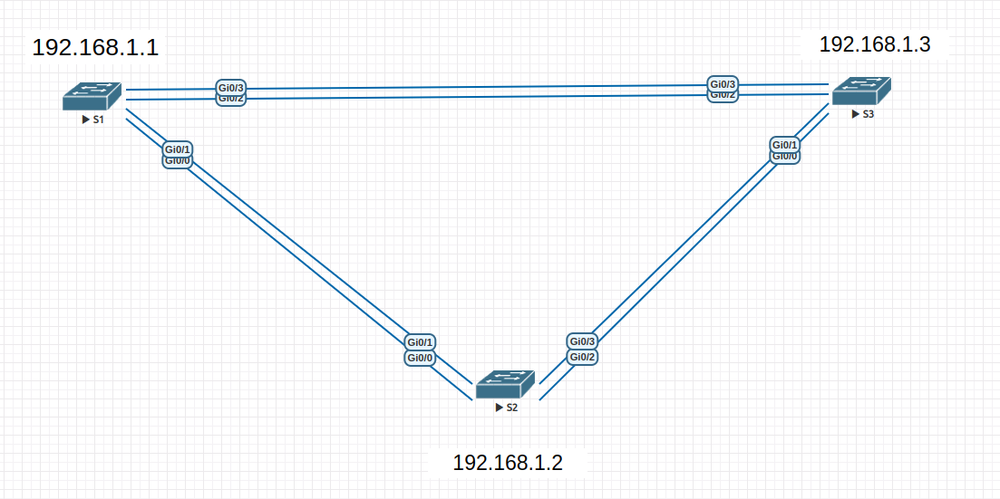

### Таблица адресации 

|Устройство|Интерфейс|IP-адрес|Маска подсети|
|:-|:-|:-|:-|
|S1|VLAN 1|192.168.1.1|255.255.255.0|
|S2|VLAN 1|192.168.1.2|255.255.255.0|
|S3|VLAN 1|192.168.1.3|255.255.255.0|

### ЧАСТЬ 1: Создание сети и настройка основных параметров устройства 

#### Настройте базовые параметры каждого коммутатора. 

hostname S1(S2,S3) 
no ip domain-lookup 
enable secret class 
line console 0 
password cisco 
login 
line vty 0 4 
password cisco 
login 
service password-encryption 
banner motd $ 
\*\*\*\*\*\*\*\*\*\*\*\*\*\*\*\*\*\*\*\*\*\*\*\*\*\*\*\*\*\*\*\*\*\*\*\*\*\*\*\*\*\*\*\*\*\*\*\*\*\*\*\*\*\*\*\*\*\*\*\*\*\*\*\*\*\*\*\*\*\* 
\*      Attention! Unauthorized access to this device is prohibited.      \* 
\*\*\*\*\*\*\*\*\*\*\*\*\*\*\*\*\*\*\*\*\*\*\*\*\*\*\*\*\*\*\*\*\*\*\*\*\*\*\*\*\*\*\*\*\*\*\*\*\*\*\*\*\*\*\*\*\*\*\*\*\*\*\*\*\*\*\*\*\*\*$ 

clock timezone Moscow +3 0 
interface vlan 1 
address 192.168.1.1 255.255.255.0 
no sh 
end 
wr 

#### Проверьте связь. 

>Проверка связи. 
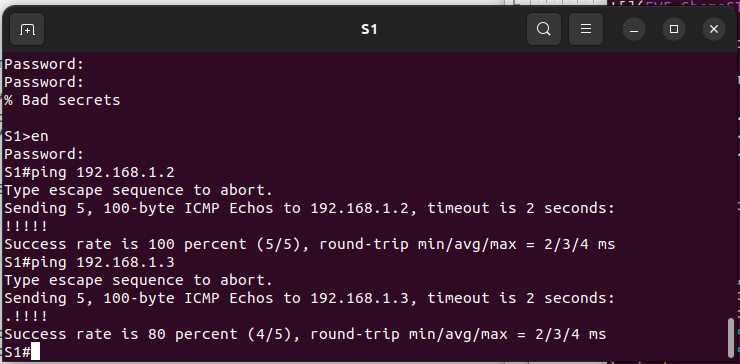 
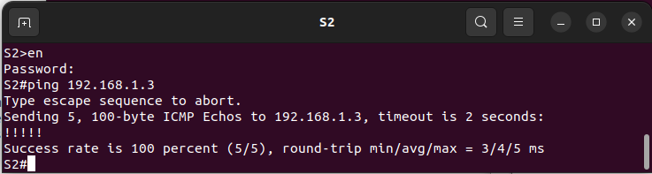 

### ЧАСТЬ 2: Определение корневого моста 

#### Отключите все порты на коммутаторах. Настройте подключенные порты в качестве транковых. 

(config)#interface range gigabitEthernet 0/0-3 
(config-if-range)#shutdown 
(config-if-range)#switchport trunk encapsulation dot1q 
(config-if-range)#switchport mode trunk 
(config-if-range)#switchport trunk allowed vlan all 

#### Включите порты Gi0/1 и Gi0/3 на всех коммутаторах. 

(config)int gi 0/1 
(config-if)#no shu 
(config-if)#int gi 0/3 
(config-if)#no shu 

#### Отобразите данные протокола spanning-tree. 

>S1#show spanning-tree 
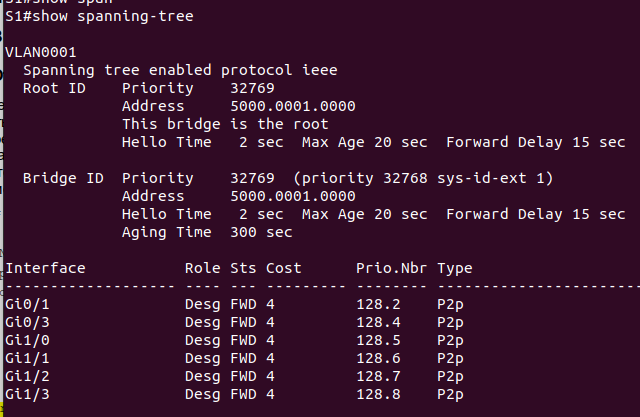 

>S2#show spanning-tree 
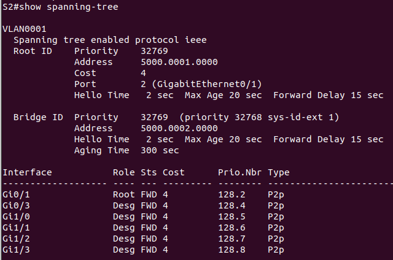 

>S3#show spanning-tree 
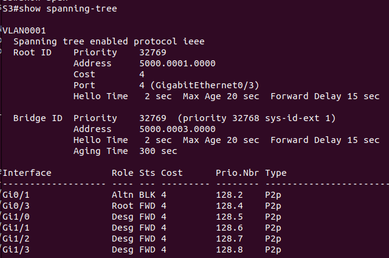 

>SHEME
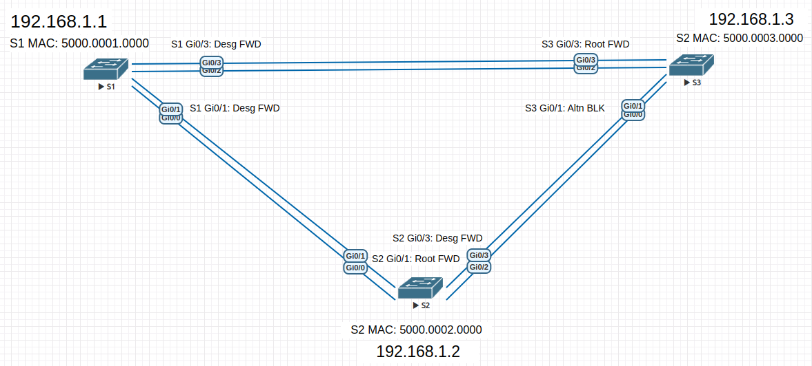 

##### Какой коммутатор является корневым мостом? 
Коммутатор S1 

##### Почему этот коммутатор был выбран протоколом spanning-tree в качестве корневого моста? 
Все коммутаторы находятся в одном vlan и имеют одинаковый RID 32769. 
Выбор корневого осуществлён по наименьшему MAC приндалежащему коммутатор S1 c MAC: 5000.0001.0000 

##### Какие порты на коммутаторе являются корневыми портами? 
Транковые порты свитчей смотрящие в сторону корневого коммутатора являются корневыми:  
S2 - Gi0/1 Root 
S3 - Gi0/3 Root 

##### Какие порты на коммутаторе являются назначенными портами? 
Транковые порты на свитчах направленные от корневого коммутатора в сторону остальных коммутаторов участников spannig-tree процесса: 
S1 - Gi0/1 Desg 
S1 - Gi0/3 Desg 
S2 - Gi0/3 Desg 
 
##### Какой порт отображается в качестве альтернативного и в настоящее время заблокирован? 
В собранной схеме только один порт свитча S3 является альтернативным и заблокированным: S3 - Gi0/1 Altn BLK  

##### Почему протокол spanning-tree выбрал этот порт в качестве невыделенного (заблокированного) порта? 
Данный порт смотрит в сторону корневого коммутатора и является альтернативным для корневого порта из за наибольшей стоимости(по умолчанию стоимость пути гигабитного порта=4) 
Линия связи коммутируемая на порт S3 - Gi0/1 имеет промежуточный коммутатор и дополнительную стоимость. В результате протокол spanning-tree блокирует порт с наибольшей 
стоимостью так как согласно принципу работы протокола в сети может быть только один логический маршрут до корневого коммутатора для избежания возниконевения петель. 

### ЧАСТЬ 3: Наблюдение за процессом выбора протоколом STP порта, исходя из стоимости портов 

#### ШАГ 1: Определите коммутатор с заблокированным портом. 

>S3#show spanning-tree 
 

>S2#show spanning-tree 
 

#### ШАГ 2: Измените стоимость порта. 

S3(config-if)#int gi0/3 
S3(config-if)#spanning-tree cost 3

#### ШАГ 3: Просмотрите изменения протокола spanning-tree. 

>S3#show spanning-tree 
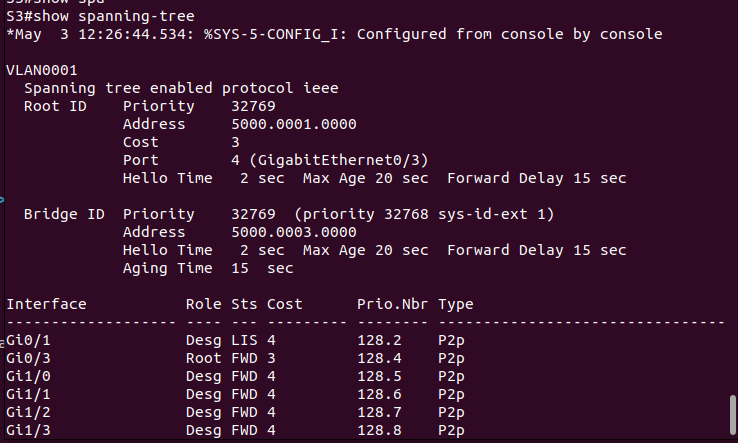 

>S2#show spanning-tree 
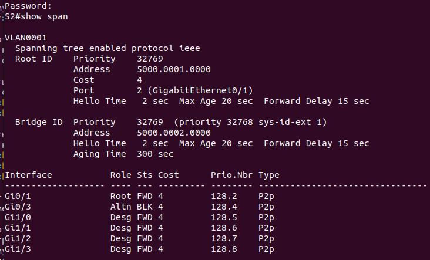 

#### ШАГ 4: Удалите изменения стоимости порта. 

S3(config-if)#int gi0/3 
S3(config-if)#no spanning-tree cost 

>S2#show spanning-tree 
 

>S3#show spanning-tree 
 

 
### ЧАСТЬ 4: Наблюдение за процессом выбора протоколом STP порта, исходя из приоритета портов 

##### Включите порты Gi0/0 и Gi0/2 на всех коммутаторах. 

(config)int gi 0/0 
(config-if)#no shu 
(config-if)#int gi 0/2 
(config-if)#no shu  

>SHEME
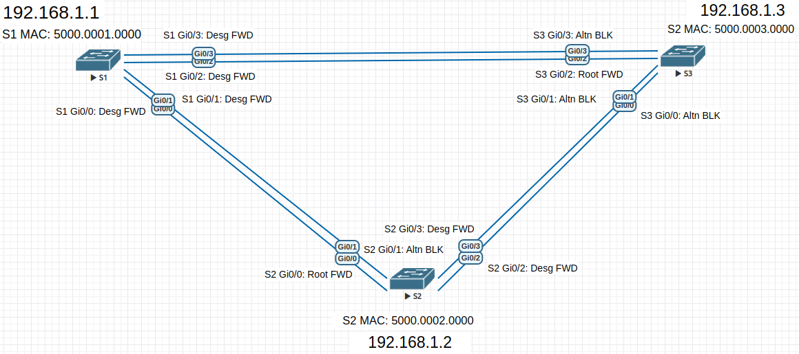 

>S2#show spanning-tree 
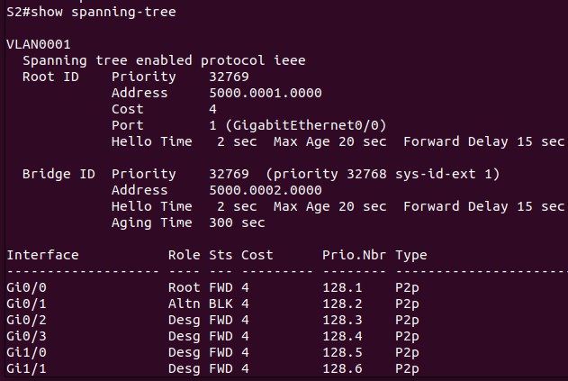 

>S3#show spanning-tree 
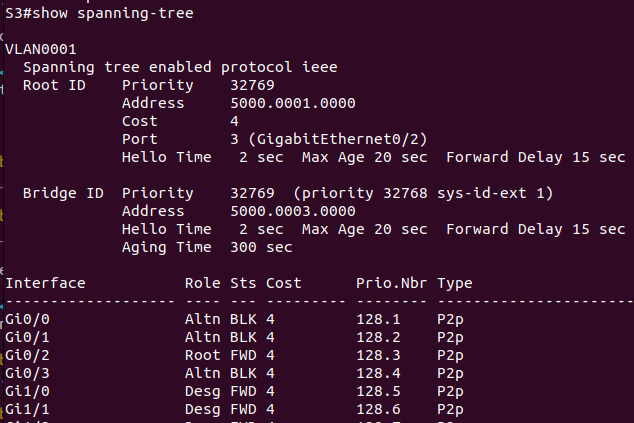 

##### Какой порт выбран протоколом STP в качестве порта корневого моста на каждом коммутаторе некорневого моста?  Почему протокол STP выбрал эти порты в качестве портов корневого моста на этих коммутаторах? 
Выбран порт с наименьшим приоритетом, приоритет порта рассматривается в случаи равной стоимости порта:  
S2 Gi0/0 root cost=4 pri=128.1 
S3 Gi0/2 root cost=4 pri=128.3 

#### Вопросы для повторения. 

##### Какое значение протокол STP использует первым после выбора корневого моста, чтобы определить выбор порта? 
Значение "root path cost" в поле BPDU, выбирается порт от которого маршрут до корневого моста имеет наименьшую стоимость. 

##### Если первое значение на двух портах одинаково, какое следующее значение будет использовать протокол STP при выборе порта? 
Будет выбран порт в сторону коммутатора с наименьшим BID(Bridge ID) состосящий из: Bridge priority и MAC Address коммутатора. 

##### Если оба значения на двух портах равны, каким будет следующее значение, которое использует протокол STP при выборе порта? 
Будет выбрано самое низкое значение порта отправителя port ID(port priority). 

