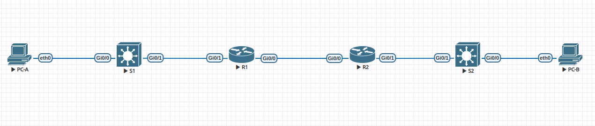
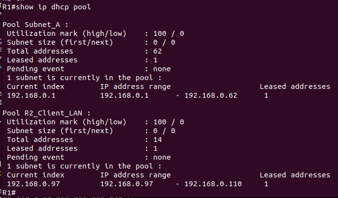
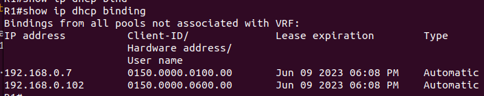
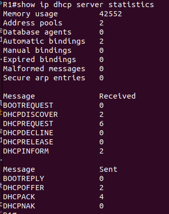
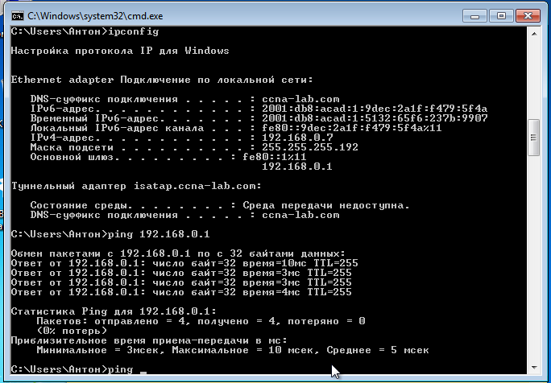
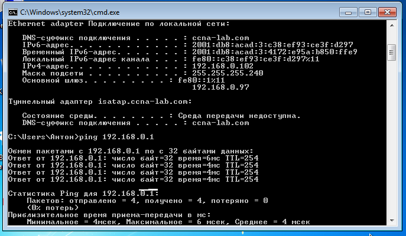
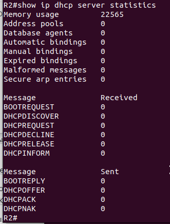

## Lab - Implement DHCPv4 

>SCHEME 

### Addressing Table 

|Device|Interface|IP Address|Subnet Mask|Default Gateway|
|:-|:-|:-|:-|:-|
|R1|G0/0|10.0.0.1|255.255.255.252|N/A|
||G0/1|N/A|N/A|N/A|
||G0/1.100|192.168.0.1|255.255.255.192|10.0.0.2|
||G0/1.200|192.168.0.65|255.255.255.224|10.0.0.2|
||G0/1.1000|N/A|N/A||
|R2|G0/0|10.0.0.2|255.255.255.252|N/A|
||G0/1|192.168.0.97|255.255.255.240|10.0.0.1|
|S1|VLAN 200|192.168.0.66|255.255.255.224|192.168.0.65|
|S2|VLAN 1|192.168.0.98|255.255.255.240|192.168.0.97|
|PC-A|NIC|DHCP|DHCP|DHCP|
|PC-B|NIC|DHCP|DHCP|DHCP|

 
 

### VLAN Table 

|VLAN|Name|Interface Assigned|
|:-|:-|:-|
|1|N/A|S2: G0/0|
|100|Clients||S1: G0/0|	
|200|Management|S1: VLAN 200|
|999|Parking_Lot|S1: G0/2-3 G1/0-3|
|1000|Native|N/A|

## PART1: Build the Network and Configure Basic Device Settings 

1. R1 config

  
click for sohw config

Building configuration... 
! 
ip dhcp excluded-address 192.168.0.1 192.168.0.5 
ip dhcp excluded-address 192.168.0.97 192.168.0.101 
! 
ip dhcp pool Subnet_A 
 network 192.168.0.0 255.255.255.192 
 default-router 192.168.0.1  
 domain-name ccna-lab.com 
 dns-server 8.8.8.8  
 lease 2 12 30 
! 
ip dhcp pool R2_Client_LAN 
 network 192.168.0.96 255.255.255.240 
 default-router 192.168.0.97  
 domain-name ccna-lab.com 
 lease 2 12 30 
! 
no ip domain lookup 
ip cef 
ipv6 unicast-routing 
ipv6 cef 
! 
interface GigabitEthernet0/0 
 ip address 10.0.0.1 255.255.255.252 
 duplex auto 
 speed auto 
 media-type rj45 
 ipv6 address FE80::1 link-local 
 ipv6 address 2001:DB8:ACAD:2::1/64 
! 
interface GigabitEthernet0/1 
 no ip address 
 duplex auto 
 speed auto 
 media-type rj45 
!          
interface GigabitEthernet0/1.100 
 description for_Clients_dhcp 
 encapsulation dot1Q 100 
 ip address 192.168.0.1 255.255.255.192 
 ip virtual-reassembly in 
 ipv6 address FE80::1 link-local 
 ipv6 address 2001:DB8:ACAD:1::1/64 
! 
interface GigabitEthernet0/1.200 
 description for_Management 
 encapsulation dot1Q 200 
 ip address 192.168.0.65 255.255.255.224 
! 
interface GigabitEthernet0/1.1000 
 description Native 
 encapsulation dot1Q 1000 native 
! 
ip route 0.0.0.0 0.0.0.0 10.0.0.2 
! 
ipv6 route ::/0 2001:DB8:ACAD:2::2 
ipv6 ioam timestamp 
! 
access-list 1 permit 192.168.0.0 0.0.0.63 

2. R2 config

  
click for see config

ipv6 unicast-routing 
ipv6 cef 
! 
interface GigabitEthernet0/0 
 ip address 10.0.0.2 255.255.255.252 
 duplex auto 
 speed auto 
 media-type rj45 
 ipv6 address FE80::2 link-local 
 ipv6 address 2001:DB8:ACAD:2::2/64 
! 
interface GigabitEthernet0/1 
 description for_Clients 
 ip address 192.168.0.97 255.255.255.240 
 ip helper-address 10.0.0.1 
 duplex auto 
 speed auto 
 media-type rj45 
 ipv6 address FE80::1 link-local 
 ipv6 address 2001:DB8:ACAD:3::1/64 
! 
ip route 0.0.0.0 0.0.0.0 10.0.0.1 
! 
ipv6 route ::/0 2001:DB8:ACAD:2::1 
ipv6 ioam timestamp 
end 

3. S1 config

  
click for see config

hostname S1 
! 
interface GigabitEthernet0/0 
 switchport access vlan 100 
 switchport mode access 
 negotiation auto 
! 
interface GigabitEthernet0/1 
 switchport trunk allowed vlan 100,200,1000 
 switchport trunk encapsulation dot1q 
 switchport trunk native vlan 1000 
 switchport mode trunk 
 negotiation auto 
! 
interface GigabitEthernet0/2 
 switchport access vlan 999 
 switchport mode access 
 shutdown 
 negotiation auto          
! 
interface Vlan200 
 ip address 192.168.0.66 255.255.255.224 
! 
ip route 0.0.0.0 0.0.0.0 192.168.0.65 

4. S2 config

  
click for see config

hostname S2 
! 
interface Vlan1 
 ip address 192.168.0.98 255.255.255.240 
! 
ip route 0.0.0.0 0.0.0.0 192.168.0.97 

#### Verify the DHCPv4 Server configuration 

>Issue the command ***show ip dhcp pool*** to examine the pool details. 
 

>Issue the command ***show ip dhcp bindings*** to examine established DHCP address assignments. 
 

>Issue the command ***show ip dhcp server statistics*** to examine DHCP messages. 
 

>Attempt to acquire an IP address from DHCP on PC-A 
 

>Attempt to acquire an IP address from DHCP on PC-B 
 

>Issue the ***show ip dhcp server statistics*** on R2 to verify DHCP messages. 
 

## Lab - Configure DHCPv6

### Addressing table

|Device|Interface|IPv6 Address|
|:-|:-|:-|
|R1|Gi0/0|2001:db8:acad:2::1/64|
|||fe80::1|
|R1|Gi0/1|2001:db8:acad:1::1/64|
|||fe80::1|
|R2|Gi0/0|2001:db8:acad:2::2/64|
|||fe80::2|
||Gi0/1|2001:db8:acad:3::1 /64|
|||fe80::1|
|PC-A|NIC|DHCP|
|PC-B|NIC|DHCP|
