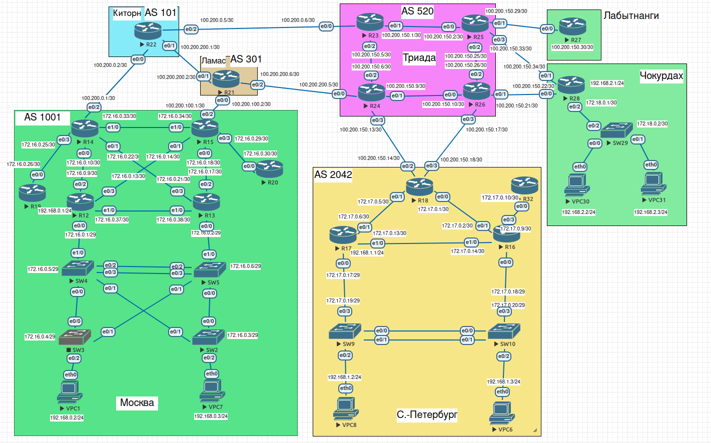

>SCHEME 
 

### Москва AS 1001

|Device|Interface|IP address/net|Vlan|Name|
|:-|:-|:-|:-|:-|
|R12|Ethernet0/0.100|172.16.0.1/29|100|Managment|
||Ethernet0/1.100|-|100|Managment|
||Ethernet0/0.200|192.168.0.1/24|200|Client|
||Ethernet0/2|172.16.0.9/30|-|-|
||Ethernet0/3|172.16.0.13/30|-|-|
|R13|Ethernet0/0.100|172.16.0.2/29|100|Managment|
||Ethernet0/1.100|-|100|Managment|
||Ethernet0/2|172.16.0.17/30|-|-|
||Ethernet0/3|172.16.0.21/30|-|-|
|R14|Ethernet0/0|172.16.0.10/30|-|-|
||Ethernet0/1|172.16.0.22/30|-|-|
||Ethernet0/2|100.200.0.1/30|-|-|
||Ethernet0/3|172.16.0.25/30|-|-|
|R15|Ethernet0/0|172.16.0.18/30|-|-|
||Ethernet0/1|172.16.0.14/30|-|-|
||Ethernet0/2|100.200.100.1/30|-|-|
||Ethernet0/3|172.16.0.29/30|-|-|
|R19|Ethernet0/0|172.16.0.26/30|-|-|
|R20|Ethernet0/0|172.16.0.30/30|-|-|
|SW2|-|172.16.0.3/29|100|Managment|
|SW3|-|172.16.0.4/29|100|Managment|
|SW4|-|172.16.0.5/29|100|Managment|
|SW5|-|172.16.0.6/29|100|Managment|
|VPC1|-|dhcp|-|-|
|VPC7|-|dhcp|-|-|
 
 

### Ламас AS 301

|Device|Interface|IP address/net|Vlan|Name|
|:-|:-|:-|:-|:-|
|R21|Ethernet0/0|100.200.100.2/30|-|-|
||Ethernet0/1|100.200.200.2/30|-|-|
||Ethernet0/2|100.200.200.6/30|-|-|
 
 

### Киторн  AS 101

|Device|Interface|IP address/net|Vlan|Name|
|:-|:-|:-|:-|:-|
|R14|Ethernet0/0|100.200.0.2/30|-|-|
||Ethernet0/1|100.200.200.1/30|-|-|
||Ethernet0/2|100.200.0.5/30|-|-|
 
 

### Триада AS 520

|Device|Interface|IP address/net|Vlan|Name|
|:-|:-|:-|:-|:-|
|R23|Ethernet0/0|100.200.0.6/30|-|-|
||Ethernet0/1|100.200.150.1/30|-|-|
||Ethernet0/2|100.200.150.5/30|-|-|
|R24|Ethernet0/0|100.200.200.5/30|-|-|
||Ethernet0/1|100.200.150.9/30|-|-|
||Ethernet0/2|100.200.150.6/30|-|-|
||Ethernet0/3|100.200.150.13/30|-|-|
|R25|Ethernet0/0|100.200.150.2/30|-|-|
||Ethernet0/1|100.200.150.29/30|-|-|
||Ethernet0/2|100.200.150.25/30|-|-|
||Ethernet0/3|100.200.150.33/30|-|-|
|R26|Ethernet0/0|100.200.150.10/30|-|-|
||Ethernet0/1|100.200.150.21/30|-|-|
||Ethernet0/2|100.200.150.26/30|-|-|
||Ethernet0/3|100.200.150.17/30|-|-|
 
 

### Лабытнанги

|Device|Interface|IP address/net|Vlan|Name|
|:-|:-|:-|:-|:-|
|R27|Ethernet0/0|100.200.150.30/30|-|-|
 
 

### Чокурдах

|Device|Interface|IP address/net|Vlan|Name|
|:-|:-|:-|:-|:-|
|R28|Ethernet0/0|100.200.150.22/30|-|-|
||Ethernet0/1|100.200.150.34/30|-|-|
||Ethernet0/2.100|172.18.0.1/30|100|Managment|
||Ethernet0/2.200|192.168.2.1/24|200|Client|
|SW29|-|172.18.0.2/30|100|Managment|
|SW29|Ethernet0/0-1|-|200|Client|
|VPC30|-|dhcp|-|-|
|VPC31|-|dhcp|-|-|
 
 

### Санкт-Петербург AS 2042

|Device|Interface|IP address/net|Vlan|Name|
|:-|:-|:-|:-|:-|
|R18|Ethernet0/0|172.17.0.1/30|-|-|
||Ethernet0/1|172.17.0.5/30|-|-|
||Ethernet0/2|100.200.150.14/30|-|-|
||Ethernet0/3|100.200.150.18/30|-|-|
|R16|Ethernet0/0.100|172.17.0.18/29|100|Managment|
||Ethernet0/1|172.17.0.2/30|-|-|
||Ethernet0/2|-|100|Managment|
||Ethernet0/3|172.17.0.9/30|-|-|
|R17|Ethernet0/0.100|172.17.0.17/29|100|Managment|
||Ethernet0/0.200|192.168.1.1/24|200|Client|
||Ethernet0/1|172.17.0.6/30|-|-|
||Ethernet0/2|-|100|Managment|
|SW9|-|172.17.0.19/29|100|Managment|
|SW9|Ethernet0/2|-|200|Client|
|SW10|-|172.17.0.20/29|100|Managment|
|SW10|Ethernet0/2|-|200|Client|
|VPC8|-|dhcp|-|-|
|VPC6|-|dhcp|-|-|

