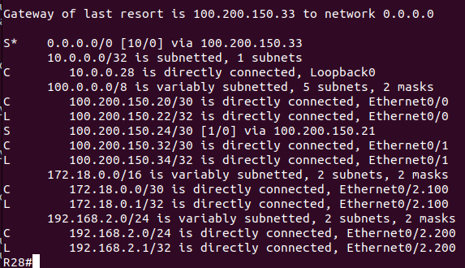
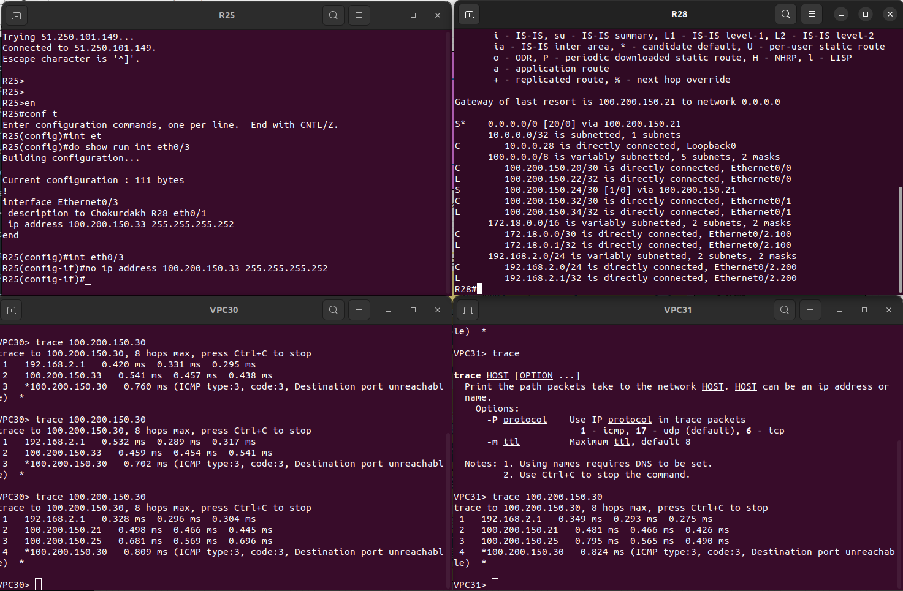
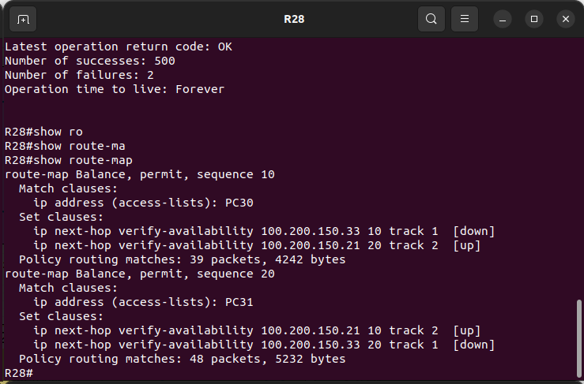

### Настроите политику маршрутизации для сетей офиса.<br>

##### Создаём два acees-list на основе которых будет моршрутизировать траффик.<br>
list PC30 - сообвествует трафику с ip отправителя 192.168.2.2<br>
list PC31 - сообвествует трафику с ip отправителя 192.168.2.3<br>

```
R28#show ip access-lists 
Extended IP access list PC30
    10 permit ip host 192.168.2.2 any (9 matches)
Extended IP access list PC31
    10 permit ip host 192.168.2.3 any (12 matches)
```
##### На основе наших access-list с помощью route-map распределяем трафик между двумя линками с провайдером.<br>
<br>
Для PC30(192.168.2.2) - назначили исходящий интерфейс e0/1 через next-hop 100.200.150.33<br>
Для PC31(192.168.2.3) - назначили исходящий интерфейс e0/0 через next-hop 100.200.150.21<br>

```
show route-map 
route-map Balance, permit, sequence 10
  Match clauses:
    ip address (access-lists): PC30 
  Set clauses:
    ip next-hop verify-availability 100.200.150.33 10 track 1  [up]
    ip next-hop verify-availability 100.200.150.21 20 track 2  [up]
  Policy routing matches: 9 packets, 978 bytes
route-map Balance, permit, sequence 20
  Match clauses:
    ip address (access-lists): PC31 
  Set clauses:
    ip next-hop verify-availability 100.200.150.21 10 track 2  [up]
    ip next-hop verify-availability 100.200.150.33 20 track 1  [up]
  Policy routing matches: 12 packets, 1308 bytes
```

Наш route-map вешаем на sub interface eth0/2.200 для сети 192.168.2.0/24, чтобы политика маршрутизации для<br> 
трафика нашей сети применялась до начала посторения маршрута.<br> 

```
interface Ethernet0/2.200
 description for Clients dhcp
 encapsulation dot1Q 200
 ip address 192.168.2.1 255.255.255.0
 ip policy route-map Balance
```
Проверяем маршрут PC30 и PC31 до R27 Лабытнанги:<br>
```
VPC30> trace 100.200.150.30
trace to 100.200.150.30, 8 hops max, press Ctrl+C to stop
 1   192.168.2.1   0.420 ms  0.331 ms  0.295 ms
 2   100.200.150.33   0.541 ms  0.457 ms  0.438 ms
 3   *100.200.150.30   0.760 ms (ICMP type:3, code:3, Destination port unreachable)  *

VPC31> trace 100.200.150.30
trace to 100.200.150.30, 8 hops max, press Ctrl+C to stop
 1   192.168.2.1   0.328 ms  0.305 ms  0.269 ms
 2   100.200.150.21   0.444 ms  0.396 ms  0.391 ms
 3   100.200.150.25   0.608 ms  0.498 ms  0.474 ms
 4   *100.200.150.30   0.717 ms (ICMP type:3, code:3, Destination port unreachable)  *
```

##### С помощью ip sla обеспечиваем отказоустойчивость через отслеживание доступнсти шлюза.<br>

Настроили ip sla 1 и ip sla 2 для разных портов ethernet и активировали их. 
```
ip sla 1
 icmp-echo 100.200.150.33 source-ip 100.200.150.34
 threshold 1
 timeout 2
 frequency 4
ip sla schedule 1 life forever start-time now
ip sla 2
 icmp-echo 100.200.150.25 source-ip 100.200.150.22
 threshold 1
 timeout 2
 frequency 4
ip sla schedule 2 life forever start-time now
```
<br>
Настроили track 1 и 2 для каждого sla
```
track 1 ip sla 1 reachability
 delay down 30 up 30
!
track 2 ip sla 2 reachability
 delay down 30 up 30
```
<br>
Установили два маршрута по умолчанию с разной метрикой, чтобы для трафика не попадающего под нашу политику для<br>PC30 и PC31 приоритетным маршрутом был interface e0/1 R28.<br>
```
ip route 0.0.0.0 0.0.0.0 100.200.150.33 10 track 1
ip route 0.0.0.0 0.0.0.0 100.200.150.21 20 track 2
```
<br>
Для каждого маршрута добавили соотвествующий track провеки достижимости по ip sla.<br>
В наш rout-map так-же добавили проверку, чтобы в случаи аварии на пути следованиия<br> 
отработала провека в route-map verify-availability и поменялся next-hop.<br>
```
route-map Balance permit 10
 match ip address PC30
 set ip next-hop verify-availability 100.200.150.33 10 track 1
 set ip next-hop verify-availability 100.200.150.21 20 track 2
!
route-map Balance permit 20
 match ip address PC31
 set ip next-hop verify-availability 100.200.150.21 10 track 2
 set ip next-hop verify-availability 100.200.150.33 20 track 1
```

#### Проверяем:<br>
>Маршрут по умолчанию<br>
<br>
>Удалил ip на eth0/3 R25<br>
<br>
>Изменеие в состоянии route-map<br>
<br>

