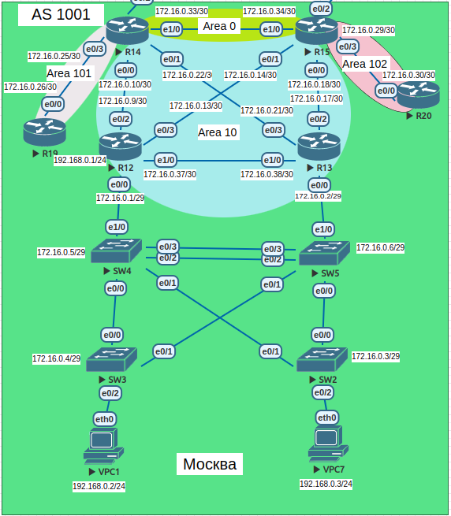
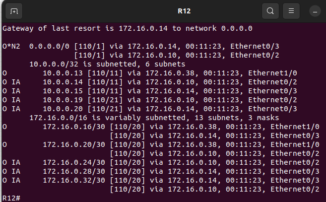
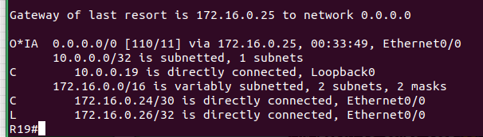
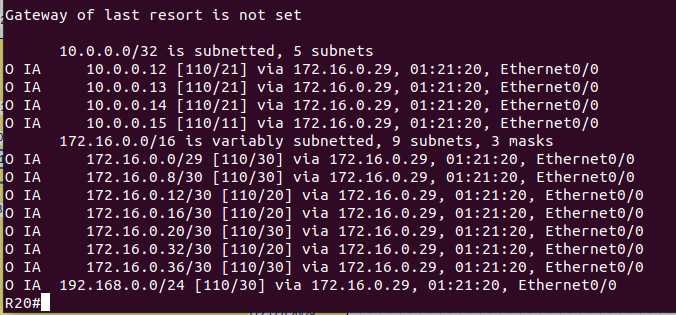

>Scheme<br>
<br>


### Москва OSPF<br>

|Device|Interface|IP address/net|Type|Area|
|:-|:-|:-|:-|:-|
|R12|Ethernet0/0.100|172.16.0.1/29|nssa|10|
||lo0|10.0.0.12/32|nssa|10|
||Ethernet0/0.200|192.168.0.1/24|nssa|10|
||Ethernet0/2|172.16.0.9/30|nssa|10|
||Ethernet0/3|172.16.0.13/30|nssa|10|
||Ethernet1/0|172.16.0.37/30|nssa|10|
|R13|Ethernet0/0.100|172.16.0.2/29|nssa|10|
||lo0|10.0.0.13/32|nssa|10|
||Ethernet0/2|172.16.0.17/30|nssa|10|
||Ethernet0/3|172.16.0.21/30|nssa|10|
||Ethernet1/0|172.16.0.38/30|nssa|10|
|R14|Ethernet0/0|172.16.0.10/30|nssa|10|
||lo0|10.0.0.14/32|Standard|0|
||Ethernet0/1|172.16.0.22/30|nssa|10|
||Ethernet0/2|100.200.0.1/30|-|-|
||Ethernet0/3|172.16.0.25/30|Totally-Stub|101|
||Ethernet1/0|172.16.0.33/30|Standard|0|
|R15|Ethernet0/0|172.16.0.18/30|nssa|10|
||lo0|10.0.0.15/32|Standard|0|
||Ethernet0/1|172.16.0.14/30|nssa|10|
||Ethernet0/2|100.200.100.1/30|-|-|
||Ethernet0/3|172.16.0.29/30|Standard|102|
||Ethernet1/0|172.16.0.34/30|Standard|0|
|R19|Ethernet0/0|172.16.0.26/30|Totally-Stub|101|
||lo0|10.0.0.19/32|Totally-stub|101|
|R20|Ethernet0/0|172.16.0.30/30|Standard|102|
||lo0|10.0.0.20/32|Standard|102|
<br>

####  Маршрутизаторы R14-R15 находятся в зоне 0 - backbone.<br>
Создал процесс ospf 1, интерфейсам lo0 и eth1/0 маршрутизаторов R14 и R15 назначили созданный процесс ospf c указанием зоны 0.<br>

```
R14#
interface Loopback0
 ip address 10.0.0.14 255.255.255.255
 ip ospf 1 area 0
interface Ethernet1/0
 description to R15 eth1/0
 ip address 172.16.0.33 255.255.255.252
 ip ospf 1 area 0
R15#
interface Loopback0
 ip address 10.0.0.15 255.255.255.255
 ip ospf 1 area 0
interface Ethernet1/0
 description to R14 eth1/0
 ip address 172.16.0.34 255.255.255.252
 ip ospf 1 area 0
```
<br>

#### Маршрутизаторы R12-R13 находятся в зоне 10. Дополнительно к маршрутам должны получать маршрут по умолчанию.<br>

На маршрутизаторах R12-R13 все интерфейсы поместили в зону 10 процесса ospf, в процессе ospf маршрутизаторов указали тип nssa<br>
для тупиковой сети с возможностью приёма маршрута по умолчанию от маршрутизаторов типа ABR: R14,R15 - для зоны 10.<br>
В процессе OSPF указали трансляцию маршрутов по умолчанию в зону 10.<br>
Интерфейсы eth0/0 и eth0/1 маршрутизаторов R14-15, поместили в зону 10.<br>

```
R14#
router ospf 1
 router-id 14.14.14.14
 area 10 nssa default-information-originate
R15#
router ospf 1
 router-id 15.15.15.15
 area 10 nssa default-information-originate
```
<br>

>R12#show ip route ospf<br>
<br>

#### Маршрутизатор R19 находится в зоне 101 и получает только маршрут по умолчанию.<br>

На маршрутизаторе R14 интерфейс eth0/3 поместили в зону 101, на R19 - интерфейсы:lo0,eth0/0, в процессе ospf для зоны применили тип totally-stub.<br>
Теперь для данной зоны есть ограничение по типу LSA. Разрешены 1 и 2 - описание линков только внутри нашей зоны 101 плюс маршрут по умолчанию<br>
через ABR.<br>

```
R14#
router ospf 1
 router-id 14.14.14.14
 area 10 nssa default-information-originate
 area 101 stub no-summary
R19#
router ospf 1
 router-id 19.19.19.19
 area 101 stub
```
<br>

>R19#show ip route<br> 
<br>

#### Маршрутизатор R20 находится в зоне 102 и получает все маршруты, кроме маршрутов до сетей зоны 101.<br>
На маршрутизаторе R15 используем ospf стандартного типа, создаём prefix-list в котором блокируем сети зоны 101<br>

```
ip prefix-list Area_101_blocking seq 5 deny 10.0.0.19/32
ip prefix-list Area_101_blocking seq 10 deny 172.16.0.24/30
ip prefix-list Area_101_blocking seq 15 permit 0.0.0.0/0 le 32
```
<br>

Наш prefix-list добавляем в процесс ospf на вход в зону 102.<br>

```
router ospf 1
 router-id 15.15.15.15
 area 10 nssa default-information-originate
 area 102 filter-list prefix Area_101_blocking in
```
<br>

В результате получаем все маршруты зон ospf кроме отфильтрованных.<br>

>R20#show ip route ospf<br>
<br>
