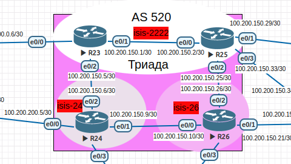
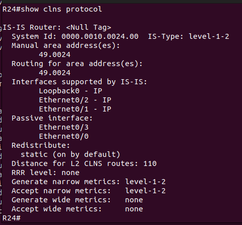
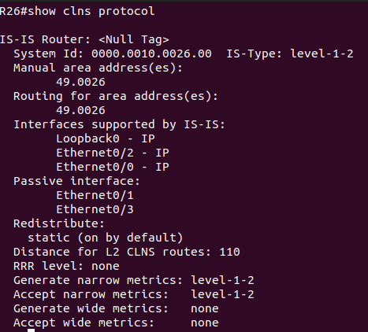
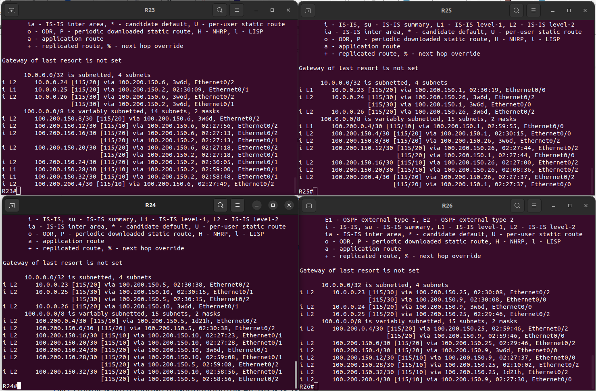

### Настроите IS-IS в ISP Триада.<br>
<br>

>ISIS Area Scheme<br>

<br>
<br>

### Триада AS 520

|Device|Interface|IP address/net|ISIS Zone number/address|ISIS Zone type|
|:-|:-|:-|:-|:-|
|R23|Ethernet0/0|100.200.0.6/30|49.2222.0000.0010.0023.00|passive-interface|
||Ethernet0/1|100.200.150.1/30|49.2222.0000.0010.0023.00|l1-l2|
||Ethernet0/2|100.200.150.5/30|49.2222.0000.0010.0023.00|l2|
||lo0|10.0.0.23/32|49.2222.0000.0010.0023.00|l1-l2|
|R25|Ethernet0/0|100.200.150.2/30|49.2222.0000.0010.0025.00|l1-l2|
||Ethernet0/1|100.200.150.29/30|49.2222.0000.0010.0025.00|passive-interface|
||Ethernet0/2|100.200.150.25/30|49.2222.0000.0010.0025.00|l2|
||Ethernet0/3|100.200.150.33/30|49.2222.0000.0010.0025.00|passive-interface|
||lo0|10.0.0.25/32|49.2222.0000.0010.0025.00|l1-l2|
|R24|Ethernet0/0|100.200.200.5/30|49.0024.0000.0010.0024.00|passive-interface|
||Ethernet0/1|100.200.150.9/30|49.0024.0000.0010.0024.00|l2|
||Ethernet0/2|100.200.150.6/30|49.0024.0000.0010.0024.00|l2|
||Ethernet0/3|100.200.150.13/30|49.0024.0000.0010.0024.00|passive-interface|
||lo0|10.0.0.24/32|49.0024.0000.0010.0024.00|l1-l2|
|R26|Ethernet0/0|100.200.150.10/30|49.0026.0000.0010.0026.00|l2|
||Ethernet0/1|100.200.150.21/30|49.0026.0000.0010.0026.00|passive-interface|
||Ethernet0/2|100.200.150.26/30|49.0026.0000.0010.0026.00|l2|
||Ethernet0/3|100.200.150.17/30|49.0026.0000.0010.0026.00|passive-interface|
||lo0|10.0.0.26/32|49.0026.0000.0010.0026.00|l1-l2|
<br>

#### R23 и R25 находятся в зоне 2222.<br>
На роутерах R23 и R25 создали процесс ISIS, процессу присвоили адрес в формате clns с одинкавым полем<br>area и уникальными значением поля system Id, для каждого роутера. <br>

```
R23#
router isis
 net 49.2222.0000.0010.0023.00
 passive-interface Ethernet0/0
R25#
router isis
 net 49.2222.0000.0010.0025.00
 passive-interface Ethernet0/1
 passive-interface Ethernet0/3
```
<br>
Инициировали интерфейсы роутера R23 и R25 учавствующие в процессе маршрутизации протокола ISIS.<br>
Для интерфейсов граничащих с соседними зонами явно указали соседство только типа - l2.<br>

```
R23#
interface Loopback0
 ip address 10.0.0.23 255.255.255.255
 ip router isis 
interface Ethernet0/1
 description to R25 eth0/0
 ip address 100.200.150.1 255.255.255.252
 ip router isis 
interface Ethernet0/2
 description to R24 eth0/2
 ip address 100.200.150.5 255.255.255.252
 ip router isis 
 isis circuit-type level-2-only
```
<br>

#### R24 находится в зоне 24.<br>

>R24#show clns protocol<br>

<br> 

#### R26 находится в зоне 26.<br>

>R26#show clns protocol<br>

<br>

>show ip route isis<br>

<br>

