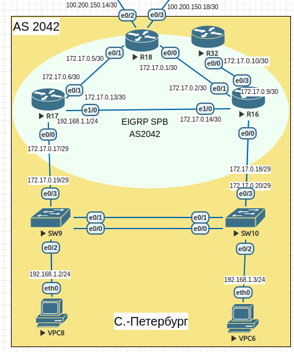
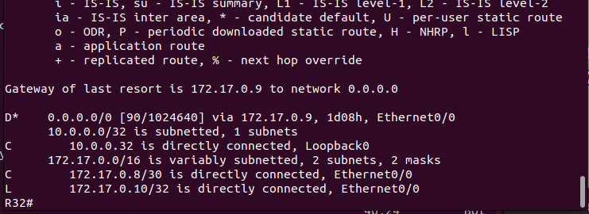
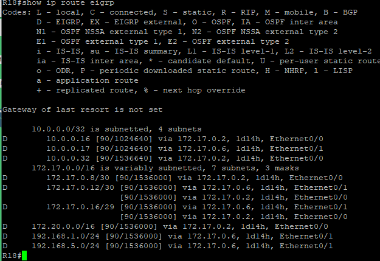
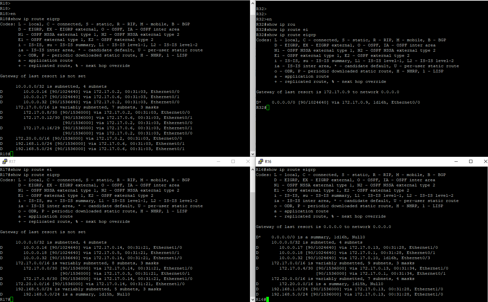

### В офисе С.-Петербург настроить EIGRP.<br>

>Scheme<br>
<br>

### Санкт-Петербург EIGRP-AS 2042<br>

|Device|Interface|IP address/net|EIGRP AS|EIGRP name|
|:-|:-|:-|:-|:-|
|R18|Ethernet0/0|172.17.0.1/30|2042|SPB|
||Ethernet0/1|172.17.0.5/30|2042|SPB|
||lo0|10.0.0.18/32|2042|SPB|
|R16|Ethernet0/0.100|172.17.0.18/29|2042|SPB|
|||172.20.0.1/30|2042|SPB|
|||172.20.0.5/30|2042|SPB|
|||172.20.0.9/30|2042|SPB|
||Ethernet0/1|172.17.0.2/30|2042|SPB|
||Ethernet0/3|172.17.0.9/30|2042|SPB|
||Ethernet1/0|172.17.0.14/30|2042|-SPB|
||lo0|10.0.0.16/32|2042|SPB|
|R17|Ethernet0/0.100|172.17.0.17/29|2042|SPB|
||Ethernet0/0.200|192.168.1.1/24|2042|SPB|
|||192.168.5.1/128|2042|SPB|
|||192.168.5.129/128|2042|SPB|
||Ethernet0/1|172.17.0.6/30|2042|SPB|
||Ethernet1/0|172.17.0.13/30|2042|SPB|
||lo0|10.0.0.17/32|2042|SPB|
|R32|Ethernet0/0|172.17.0.10/30|2042|SPB|
||lo0|10.0.0.32/32|2042|SPB|
<br>

На каждом маршрутизаторе офиса С.-Петербурга создаём именованный процесс EIGRP SPB, в который добавляем необходимые нам сети.<br>
На каждом маршрутизаторе задан ip адрес для петлевого интерфейса который будет являться router-id для нашего процесса EIGRP.<br>

R16 config EIGRP SPB
<details>
  <summary>click for see config</summary>
  router eigrp SPB<br>
 !<br>
 address-family ipv4 unicast autonomous-system 2042<br>
  !<br>
  af-interface Ethernet0/0.100<br>
   passive-interface<br>
  exit-af-interface<br>
  !<br>
  af-interface Ethernet0/3<br>
   summary-address 0.0.0.0 0.0.0.0<br>
  exit-af-interface<br>
  !<br>
  af-interface Loopback0<br>
   passive-interface<br>
  exit-af-interface<br>
  !<br>
  af-interface Ethernet0/1<br>
   summary-address 172.20.0.0 255.255.0.0<br>
  exit-af-interface<br>
  !<br>
  af-interface Ethernet1/0<br>
   summary-address 172.20.0.0 255.255.0.0<br>
  exit-af-interface<br>
  !<br>
  topology base<br>
  exit-af-topology<br>
  network 10.0.0.16 0.0.0.0<br>
  network 172.17.0.0<br>
  network 172.20.0.0<br>
 exit-address-family<br>
</details>

R17 config EIGRP SPB
<details>
  <summary>click for see config</summary>
  router eigrp SPB<br>
 !<br>
 address-family ipv4 unicast autonomous-system 2042<br>
  !<br>
  af-interface Ethernet0/0.100<br>
   passive-interface<br>
  exit-af-interface<br>
  !<br>
  af-interface Ethernet0/0.200<br>
   passive-interface<br>
  exit-af-interface<br>
  !<br>
  af-interface Loopback0<br>
   passive-interface<br>
  exit-af-interface<br>
  !<br>
  af-interface Ethernet0/1<br>
   summary-address 192.168.5.0 255.255.255.0<br>
  exit-af-interface<br>
  !<br>
  af-interface Ethernet1/0<br>
   summary-address 192.168.5.0 255.255.255.0<br>
  exit-af-interface<br>
  !<br>
  topology base<br>
  exit-af-topology<br>
  network 10.0.0.17 0.0.0.0<br>
  network 172.17.0.0<br>
  network 192.168.0.0 0.0.255.255<br>
 exit-address-family<br>
</details>

R18 config EIGRP SPB
<details>
  <summary>click for see config</summary>
!<br>
router eigrp SPB<br>
 !<br>
 address-family ipv4 unicast autonomous-system 2042<br>
  !<br>
  topology base<br>
  exit-af-topology<br>
  network 10.0.0.18 0.0.0.0<br>
  network 172.17.0.0<br>
 exit-address-family<br>
!<br>
</details>

R32 config EIGRP SPB
<details>
  <summary>click for see config</summary>
!<br>
router eigrp SPB<br>
 !<br>
 address-family ipv4 unicast autonomous-system 2042<br>
  !<br>
  topology base<br>
  exit-af-topology<br>
  network 10.0.0.32 0.0.0.0<br>
  network 172.17.0.0<br>
 exit-address-family<br>
!<br>
ip forward-protocol nd<br>
!<br>
</details>

#### R32 получает только маршрут по умолчанию.<br>

В настройках EIGRP интерфейса eth0/3 маршрутизатора R16 настраиваем суммаризацию включающую все существующие ip адреса<br>

```
af-interface Ethernet0/3
   summary-address 0.0.0.0 0.0.0.0
  exit-af-interface
```
<br>

Таким образом в таблице маршрутизации R32 появляется маршрут по умолчанию анонсируемый протоколом EIGRP<br>

<br>

#### R16-17 анонсируют только суммарные префиксы.<br>

На маршрутизаторах R16-17 включил суммаризацию сетей на интерфейсах смотрящих в сторону соседей, так как ip адреса моей сети<br>
не подходят для использования суммаризации eigrp выполняемой на основе классов подсетей.<br>

```
R16#
  af-interface Ethernet0/1
   summary-address 172.20.0.0 255.255.0.0
  exit-af-interface
  !
  af-interface Ethernet1/0
   summary-address 172.20.0.0 255.255.0.0
  exit-af-interface

R17#
  af-interface Ethernet0/1
   summary-address 192.168.5.0 255.255.255.0
  exit-af-interface
  !
  af-interface Ethernet1/0
   summary-address 192.168.5.0 255.255.255.0
  exit-af-interface
```
<br>

Проверяем.<br> 
На маршрутизаторе R18 маршруты к сетям: 172.20.0.0/30; 172.20.0.4/30; 172.20.0.8/30; 192.168.5.0/128; 192.168.5.128/128<br>
появились в таблице маршрутизации одной суммарной записью для каждой подсети.<br>

<br>

<br>
