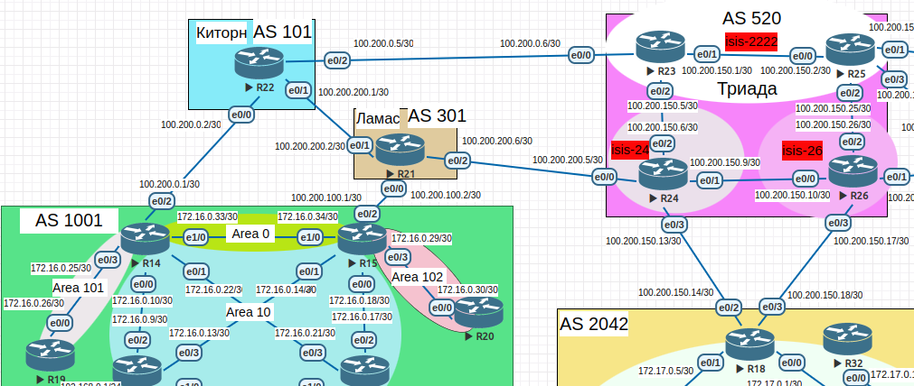
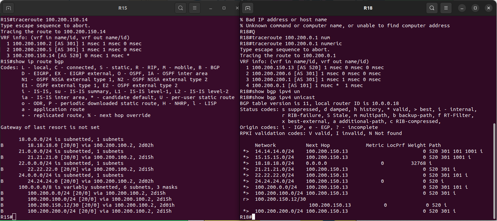

>Scheme 
 

### Москва BGP AS 1001 

|Device|Interface|IP address/net|network|neighbor ip/AS|
|:-|:-|:-|:-|:-|
|R14|Ethernet0/2|100.200.0.1/30|14.14.14.0/24|100.200.0.2 101|
|R15|Ethernet0/2|100.200.100.1/30|15.15.15.0/24|100.200.100.2 301|

### Киторн  AS 101 

|Device|Interface|IP address/net|network|neighbor ip/AS|
|:-|:-|:-|:-|:-|
|R22|Ethernet0/0|100.200.0.2/30|22.22.22.0/24|100.200.0.1 1001|
||||100.200.0.0/24||
||Ethernet0/1|100.200.200.1/30|22.22.22.0/24|100.200.200.2 301|
||||100.200.0.0/24||

### Ламас AS 301 

|Device|Interface|IP address/net|network|neighbor ip/AS|
|:-|:-|:-|:-|:-|
|R21|Ethernet0/0|100.200.100.1/30|21.21.21.0/24|100.200.100.1 1001|
||||100.200.100.0/24||
||||100.200.200.0/24||
||Ethernet0/1|100.200.200.2/30|21.21.21.0/24|100.200.200.1 101|
||||100.200.100.0/24||
||||100.200.200.0/24||
||Ethernet0/2|100.200.200.6/30|21.21.21.0/24|100.200.200.5 520|
||||100.200.100.0/24||
||||100.200.200.0/24||

### Триада AS 520 

|Device|Interface|IP address/net|network|neighbor ip/AS|
|:-|:-|:-|:-|:-|
|R24|Ethernet0/0|100.200.200.5/30|24.24.24.0/24|100.200.200.6 301|
||||100.200.150.12/30||
||Ethernet0/3|100.200.150.13/30|24.24.24.0/24|100.200.150.14 2042|
||||100.200.150.12/30||

### Санкт-Петербург AS 2042 

|Device|Interface|IP address/net|network|neighbor ip/AS|
|:-|:-|:-|:-|:-|
|R18|Ethernet0/2|100.200.150.14/30|18.18.18.0/24|100.200.150.13 520|

##### Настроите eBGP между офисом Москва и двумя провайдерами - Киторн и Ламас. 

На маршрутизаторах R14,R15,R21,R22 инициируем процесс bgp с указанием соответвующих AS, 
предварительно добавиv статический маршрут в Null0 на всех роутерах для сетей которые  
хотим анонсировать по bgp 

R14 config BGP Moscow

  
click for see config

router bgp 1001 
 bgp log-neighbor-changes 
 neighbor 100.200.0.2 remote-as 101 
 ! 
 address-family ipv4 
  network 14.14.14.0 mask 255.255.255.0 
  neighbor 100.200.0.2 activate 
 exit-address-family 

R15 config BGP Moscow

  
click for see config

router bgp 1001 
 bgp log-neighbor-changes 
 neighbor 100.200.100.2 remote-as 301 
 ! 
 address-family ipv4 
  network 15.15.15.0 mask 255.255.255.0 
  neighbor 100.200.100.2 activate 
 exit-address-family 

##### Настроите eBGP между провайдерами Киторн и Ламас. 

R22 config BGP Kitorn

  
click for see config

router bgp 101 
 bgp log-neighbor-changes 
 neighbor 100.200.0.1 remote-as 1001 
 neighbor 100.200.0.6 remote-as 520 
 neighbor 100.200.200.2 remote-as 301 
 ! 
 address-family ipv4 
  network 22.22.22.0 mask 255.255.255.0 
  network 100.200.0.0 mask 255.255.255.0 
  neighbor 100.200.0.1 activate 
  neighbor 100.200.0.6 activate 
  neighbor 100.200.200.2 activate 
 exit-address-family 

R21 config BGP Lamas

  
click for see config

router bgp 301 
 bgp log-neighbor-changes 
 neighbor 100.200.100.1 remote-as 1001 
 neighbor 100.200.200.1 remote-as 101 
 neighbor 100.200.200.5 remote-as 520 
 ! 
 address-family ipv4 
  network 21.21.21.0 mask 255.255.255.0 
  network 100.200.100.0 mask 255.255.255.0 
  network 100.200.200.0 mask 255.255.255.0 
  neighbor 100.200.100.1 activate 
  neighbor 100.200.200.1 activate 
  neighbor 100.200.200.5 activate 
 exit-address-family 

##### Настроите eBGP между Ламас и Триада. 

R24 config BGP Triada

  
click for see config

router bgp 520 
 bgp log-neighbor-changes 
 neighbor 100.200.150.14 remote-as 2042 
 neighbor 100.200.200.6 remote-as 301 
 ! 
 address-family ipv4 
  network 24.24.24.0 mask 255.255.255.0 
  network 100.200.150.12 mask 255.255.255.252 
  neighbor 100.200.150.14 activate 
  neighbor 100.200.200.6 activate 
 exit-address-family 

 

##### Настроите eBGP между офисом С.-Петербург и провайдером Триада. 

R18 config BGP SPB

  
click for see config

router bgp 2042 
 bgp log-neighbor-changes 
 network 18.18.18.0 mask 255.255.255.0 
 neighbor 100.200.150.13 remote-as 520 

##### Организуете IP доступность между пограничным роутерами офисами Москва и С.-Петербург. 

После настройки и запуска процесса bgp на роутерах:R14,R15,R18,R21,R22,R24 - появилась ip связанность 
между роутерами офиса Москвы и С.-Петербурга. 

 

На скриншоте выше при проверке доступности ip шлюза Москвы из С.-петербурга и обратно в выводе маршрута 
отображены не только транзитные адреса шлюзов но и номера автономных систем протокола eBGP. 

